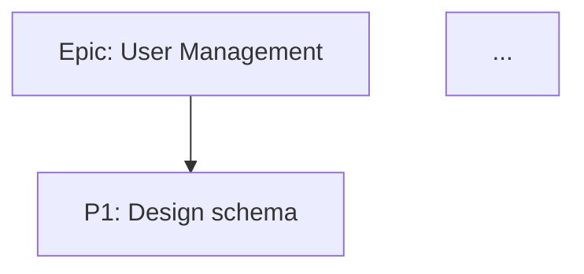

# Existing Beads Structure and Architecture

> Comprehensive specification of the Go beads codebase for porting to Rust.
> This document serves as the complete reference for the Rust port - consult this instead of Go source files.

---

## Table of Contents

1. [Project Overview](#1-project-overview)
2. [Directory Structure](#2-directory-structure)
3. [Data Types and Models](#3-data-types-and-models)
4. [Storage Interface Specification](#4-storage-interface-specification)
5. [SQLite Storage Implementation](#5-sqlite-storage-implementation)
6. [CLI Commands Specification](#6-cli-commands-specification)
7. [JSONL Import/Export System](#7-jsonl-importexport-system)
8. [Ready/Blocked Logic and Dependency Graph](#8-readyblocked-logic-and-dependency-graph)
9. [Configuration System](#9-configuration-system)
10. [Validation Rules](#10-validation-rules)
11. [ID Generation and Content Hashing](#11-id-generation-and-content-hashing)
12. [Key Architectural Patterns](#12-key-architectural-patterns)
13. [Error Handling](#13-error-handling)
14. [Porting Considerations](#14-porting-considerations)

---

## 1. Project Overview

**Location:** `./legacy_beads/` (gitignored reference copy)

**Statistics:**
- ~267,622 lines of Go code
- ~100 files in SQLite storage alone
- 40 database migrations
- 15+ CLI commands with extensive flag sets
- 62+ storage interface methods

**Core Architecture:**
- SQLite + JSONL hybrid storage
- Optional daemon mode with RPC (not porting initially)
- Content-addressable issues with hash-based IDs
- Git-integrated synchronization
- Non-invasive design philosophy (no auto git hooks, no daemon required)

**Key Design Principles (br vs bd):**
- **No automatic git hooks** — Users add hooks manually if desired
- **No automatic git operations** — No auto-commit, no auto-push
- **No daemon/RPC** — Simple CLI only, no background processes
- **Explicit over implicit** — Every git operation requires explicit user command

---

## 2. Directory Structure

```
legacy_beads/
├── beads.go                    # Package root, version info
├── cmd/
│   └── bd/                     # CLI entry point (~100 files)
│       ├── main.go             # Entry point, Cobra root command
│       ├── create.go           # Issue creation
│       ├── update.go           # Issue updates
│       ├── close.go            # Issue closing
│       ├── list.go             # Issue listing
│       ├── show.go             # Issue details
│       ├── ready.go            # Ready work queries
│       ├── blocked.go          # Blocked issues queries
│       ├── dep.go              # Dependency management
│       ├── label.go            # Label management
│       ├── search.go           # Full-text search
│       ├── stats.go            # Statistics
│       ├── sync.go             # Git synchronization
│       ├── config.go           # Configuration
│       ├── init.go             # Initialize workspace
│       ├── export.go           # JSONL export
│       ├── import.go           # JSONL import
│       ├── autoflush.go        # Auto-export logic
│       ├── autoimport.go       # Auto-import logic
│       ├── daemon*.go          # Daemon mode (SKIP)
│       └── ...
├── internal/
│   ├── types/                  # Core data types
│   │   ├── types.go            # Issue, Dependency, etc. (42KB)
│   │   ├── id_generator.go     # Hash-based ID generation
│   │   ├── lock.go             # Lock types
│   │   └── validation.go       # Validation helpers
│   ├── storage/
│   │   ├── storage.go          # Storage interface (10KB, 62+ methods)
│   │   ├── sqlite/             # SQLite implementation (PORT THIS)
│   │   │   ├── store.go        # Main storage struct
│   │   │   ├── schema.go       # Database schema
│   │   │   ├── queries.go      # SQL queries
│   │   │   ├── issues.go       # Issue CRUD
│   │   │   ├── dependencies.go # Dependency operations
│   │   │   ├── labels.go       # Label operations
│   │   │   ├── comments.go     # Comment operations
│   │   │   ├── events.go       # Event/audit operations
│   │   │   ├── ready.go        # Ready work queries
│   │   │   ├── blocked.go      # Blocked cache management
│   │   │   ├── dirty_issues.go # Dirty tracking
│   │   │   ├── config.go       # Config storage
│   │   │   ├── metadata.go     # Metadata storage
│   │   │   ├── export_hashes.go# Export hash tracking
│   │   │   ├── migrations/     # 40 migrations
│   │   │   │   ├── 001_dirty_issues_table.sql
│   │   │   │   ├── ...
│   │   │   │   └── 040_quality_score_column.sql
│   │   │   └── ...
│   │   ├── dolt/               # Dolt backend (DO NOT PORT)
│   │   ├── memory/             # In-memory backend (for testing)
│   │   └── factory/            # Backend factory
│   ├── export/                 # JSONL export logic
│   ├── autoimport/             # Auto-import from JSONL
│   ├── importer/               # Import logic with collision detection
│   ├── compact/                # JSONL compaction
│   ├── configfile/             # Configuration file handling
│   ├── validation/             # Input validation
│   ├── hooks/                  # Hook system (SKIP for br)
│   ├── git/                    # Git integration
│   ├── rpc/                    # RPC daemon (SKIP initially)
│   ├── linear/                 # Linear.app integration (SKIP)
│   └── ui/                     # Terminal UI helpers
└── docs/                       # Documentation
```

---

## 3. Data Types and Models

### 3.1 Issue Struct (Primary Entity)

The `Issue` struct is the primary data entity. For the Rust port, we exclude Gastown-specific fields (agent, molecule, gate, rig, convoy, HOP features).

**Fields to Port:**

```go
type Issue struct {
    // === Core Identification ===
    ID          string `json:"id"`           // Hash-based ID (e.g., "bd-abc123")
    ContentHash string `json:"-"`            // SHA256, NOT exported to JSONL

    // === Content Fields ===
    Title              string `json:"title"`                         // Required, max 500 chars
    Description        string `json:"description,omitempty"`
    Design             string `json:"design,omitempty"`
    AcceptanceCriteria string `json:"acceptance_criteria,omitempty"`
    Notes              string `json:"notes,omitempty"`

    // === Status & Workflow ===
    Status    Status    `json:"status,omitempty"`      // open, in_progress, blocked, closed, etc.
    Priority  int       `json:"priority"`              // 0-4 (P0-P4), NO omitempty (0 is valid)
    IssueType IssueType `json:"issue_type,omitempty"`  // task, bug, feature, epic, etc.

    // === Assignment ===
    Assignee         string `json:"assignee,omitempty"`
    Owner            string `json:"owner,omitempty"`           // Git author email for attribution
    EstimatedMinutes *int   `json:"estimated_minutes,omitempty"`

    // === Timestamps ===
    CreatedAt       time.Time  `json:"created_at"`
    CreatedBy       string     `json:"created_by,omitempty"`
    UpdatedAt       time.Time  `json:"updated_at"`
    ClosedAt        *time.Time `json:"closed_at,omitempty"`
    CloseReason     string     `json:"close_reason,omitempty"`
    ClosedBySession string     `json:"closed_by_session,omitempty"`  // Claude Code session ID

    // === Time-Based Scheduling ===
    DueAt      *time.Time `json:"due_at,omitempty"`       // When issue should complete
    DeferUntil *time.Time `json:"defer_until,omitempty"`  // Hide from bd ready until

    // === External Integration ===
    ExternalRef  *string `json:"external_ref,omitempty"`   // e.g., "gh-9", "jira-ABC"
    SourceSystem string  `json:"source_system,omitempty"`  // Federation source identifier

    // === Compaction Metadata ===
    CompactionLevel   int        `json:"compaction_level,omitempty"`   // 0=none, 1=minor, 2=major
    CompactedAt       *time.Time `json:"compacted_at,omitempty"`
    CompactedAtCommit *string    `json:"compacted_at_commit,omitempty"`
    OriginalSize      int        `json:"original_size,omitempty"`       // Bytes before compaction

    // === Internal Routing (NOT exported to JSONL) ===
    SourceRepo     string `json:"-"`  // Which repo owns this issue
    IDPrefix       string `json:"-"`  // Override prefix for ID generation
    PrefixOverride string `json:"-"`  // Replace config prefix entirely

    // === Relational Data ===
    Labels       []string      `json:"labels,omitempty"`
    Dependencies []*Dependency `json:"dependencies,omitempty"`
    Comments     []*Comment    `json:"comments,omitempty"`

    // === Soft-Delete (Tombstone) ===
    DeletedAt    *time.Time `json:"deleted_at,omitempty"`
    DeletedBy    string     `json:"deleted_by,omitempty"`
    DeleteReason string     `json:"delete_reason,omitempty"`
    OriginalType string     `json:"original_type,omitempty"`  // Type before deletion

    // === Messaging/Ephemeral ===
    Sender    string `json:"sender,omitempty"`     // For message-type issues
    Ephemeral bool   `json:"ephemeral,omitempty"`  // If true, not exported to JSONL

    // === Context Markers ===
    Pinned     bool `json:"pinned,omitempty"`      // Persistent context marker
    IsTemplate bool `json:"is_template,omitempty"` // Read-only template
}
```

**Fields NOT to Port (Gastown features):**

```go
// DO NOT PORT - Agent Identity Fields
HookBead     string     `json:"hook_bead,omitempty"`
RoleBead     string     `json:"role_bead,omitempty"`
AgentState   AgentState `json:"agent_state,omitempty"`
LastActivity *time.Time `json:"last_activity,omitempty"`
RoleType     string     `json:"role_type,omitempty"`
Rig          string     `json:"rig,omitempty"`

// DO NOT PORT - Molecule/Work Type
MolType  MolType  `json:"mol_type,omitempty"`
WorkType WorkType `json:"work_type,omitempty"`

// DO NOT PORT - Gate Fields (Async Coordination)
AwaitType string        `json:"await_type,omitempty"`
AwaitID   string        `json:"await_id,omitempty"`
Timeout   time.Duration `json:"timeout,omitempty"`
Waiters   []string      `json:"waiters,omitempty"`
Holder    string        `json:"holder,omitempty"`

// DO NOT PORT - HOP Fields (Entity Tracking)
Creator      *EntityRef   `json:"creator,omitempty"`
Validations  []Validation `json:"validations,omitempty"`
QualityScore *float32     `json:"quality_score,omitempty"`
Crystallizes bool         `json:"crystallizes,omitempty"`

// DO NOT PORT - Event Fields
EventKind string `json:"event_kind,omitempty"`
Actor     string `json:"actor,omitempty"`
Target    string `json:"target,omitempty"`
Payload   string `json:"payload,omitempty"`

// DO NOT PORT - Bonding (Compound Molecules)
BondedFrom []BondRef `json:"bonded_from,omitempty"`
```

### 3.2 Status Enum

```go
const (
    StatusOpen       Status = "open"        // Default status for new issues
    StatusInProgress Status = "in_progress" // Work has begun
    StatusBlocked    Status = "blocked"     // Explicitly marked blocked (manual)
    StatusDeferred   Status = "deferred"    // Postponed for later
    StatusClosed     Status = "closed"      // Complete
    StatusTombstone  Status = "tombstone"   // Soft-deleted, preserved for history
    StatusPinned     Status = "pinned"      // Persistent context marker
    StatusHooked     Status = "hooked"      // Attached to agent's hook (Gastown - optional)
)

// ValidStatuses returns all valid status values
func ValidStatuses() []Status {
    return []Status{
        StatusOpen, StatusInProgress, StatusBlocked,
        StatusDeferred, StatusClosed, StatusTombstone, StatusPinned,
    }
}

// IsTerminal returns true if the status represents a completed state
func (s Status) IsTerminal() bool {
    return s == StatusClosed || s == StatusTombstone
}

// IsActive returns true if the status represents active work
func (s Status) IsActive() bool {
    return s == StatusOpen || s == StatusInProgress
}
```

**Status Transitions:**

```
                    ┌─────────────────────────────────────┐
                    │                                     │
                    v                                     │
    ┌──────┐     ┌─────────────┐     ┌────────┐          │
    │ open │────▶│ in_progress │────▶│ closed │          │
    └──────┘     └─────────────┘     └────────┘          │
       │               │                  │              │
       │               │                  │              │
       v               v                  v              │
    ┌─────────┐   ┌─────────┐      ┌───────────┐        │
    │ blocked │   │ deferred │     │ tombstone │        │
    └─────────┘   └─────────┘      └───────────┘        │
       │               │                                 │
       └───────────────┴─────────────────────────────────┘
                    (reopen)
```

### 3.3 IssueType Enum

**Types to Port:**

```go
const (
    TypeBug     IssueType = "bug"      // Defect to fix
    TypeFeature IssueType = "feature"  // New functionality
    TypeTask    IssueType = "task"     // Generic work item (default)
    TypeEpic    IssueType = "epic"     // Container for related issues
    TypeChore   IssueType = "chore"    // Maintenance/housekeeping
    TypeDocs    IssueType = "docs"     // Documentation
    TypeQuestion IssueType = "question" // Question/discussion
)

// Default type for new issues
const DefaultIssueType = TypeTask
```

**Types NOT to Port (Gastown):**

```go
// DO NOT PORT
TypeMessage      IssueType = "message"       // Ephemeral inter-worker
TypeMergeRequest IssueType = "merge-request"
TypeMolecule     IssueType = "molecule"      // Template for hierarchies
TypeGate         IssueType = "gate"          // Async coordination
TypeAgent        IssueType = "agent"         // Agent identity
TypeRole         IssueType = "role"          // Agent role definition
TypeRig          IssueType = "rig"           // Multi-repo workspace
TypeConvoy       IssueType = "convoy"        // Cross-project tracking
TypeEvent        IssueType = "event"         // Operational state change
TypeSlot         IssueType = "slot"          // Exclusive access
```

### 3.4 Dependency Struct

```go
type Dependency struct {
    IssueID     string         `json:"issue_id"`              // The issue that has the dependency
    DependsOnID string         `json:"depends_on_id"`         // The issue being depended on
    Type        DependencyType `json:"type"`                  // Relationship type
    CreatedAt   time.Time      `json:"created_at"`
    CreatedBy   string         `json:"created_by,omitempty"`
    Metadata    string         `json:"metadata,omitempty"`    // Type-specific JSON blob
    ThreadID    string         `json:"thread_id,omitempty"`   // Conversation threading
}
```

### 3.5 DependencyType Enum

**Types to Port:**

```go
const (
    // === Workflow Types (affect ready work calculation) ===
    DepBlocks            DependencyType = "blocks"             // A blocks B = B depends on A
    DepParentChild       DependencyType = "parent-child"       // Hierarchical relationship
    DepConditionalBlocks DependencyType = "conditional-blocks" // Blocks only if condition met
    DepWaitsFor          DependencyType = "waits-for"          // Soft block, waits for children

    // === Association Types (informational only) ===
    DepRelated        DependencyType = "related"          // Soft link for reference
    DepDiscoveredFrom DependencyType = "discovered-from"  // Found during work on parent

    // === Graph Link Types (informational) ===
    DepRepliesTo  DependencyType = "replies-to"   // Conversation threading
    DepRelatesTo  DependencyType = "relates-to"   // Bidirectional reference
    DepDuplicates DependencyType = "duplicates"   // Marks as duplicate of
    DepSupersedes DependencyType = "supersedes"   // Replaces another issue

    // === Reference Types ===
    DepCausedBy DependencyType = "caused-by"  // Root cause linkage
)

// AffectsReadyWork returns true for dependency types that block ready work
func (t DependencyType) AffectsReadyWork() bool {
    switch t {
    case DepBlocks, DepParentChild, DepConditionalBlocks, DepWaitsFor:
        return true
    default:
        return false
    }
}

// IsBlocking returns true for types that can create blocking relationships
func (t DependencyType) IsBlocking() bool {
    return t == DepBlocks || t == DepParentChild || t == DepConditionalBlocks
}
```

**Types NOT to Port (Gastown):**

```go
// DO NOT PORT - HOP Entity Types
DepAuthoredBy  DependencyType = "authored-by"
DepAssignedTo  DependencyType = "assigned-to"
DepApprovedBy  DependencyType = "approved-by"
DepAttests     DependencyType = "attests"
DepTracks      DependencyType = "tracks"
DepUntil       DependencyType = "until"
DepValidates   DependencyType = "validates"
DepDelegatedFrom DependencyType = "delegated-from"
```

### 3.6 Comment Struct

```go
type Comment struct {
    ID        int64     `json:"id"`         // Auto-increment ID
    IssueID   string    `json:"issue_id"`   // Parent issue
    Author    string    `json:"author"`     // Who wrote the comment
    Text      string    `json:"text"`       // Markdown content
    CreatedAt time.Time `json:"created_at"`
}
```

### 3.7 Event Struct (Audit Trail)

```go
type Event struct {
    ID        int64     `json:"id"`
    IssueID   string    `json:"issue_id"`
    EventType EventType `json:"event_type"`
    Actor     string    `json:"actor"`                // Who performed the action
    OldValue  *string   `json:"old_value,omitempty"`  // Previous value (JSON)
    NewValue  *string   `json:"new_value,omitempty"`  // New value (JSON)
    Comment   *string   `json:"comment,omitempty"`    // Optional description
    CreatedAt time.Time `json:"created_at"`
}

// EventType constants
const (
    EventCreated           EventType = "created"
    EventUpdated           EventType = "updated"
    EventStatusChanged     EventType = "status_changed"
    EventPriorityChanged   EventType = "priority_changed"
    EventAssigneeChanged   EventType = "assignee_changed"
    EventCommented         EventType = "commented"
    EventClosed            EventType = "closed"
    EventReopened          EventType = "reopened"
    EventDependencyAdded   EventType = "dependency_added"
    EventDependencyRemoved EventType = "dependency_removed"
    EventLabelAdded        EventType = "label_added"
    EventLabelRemoved      EventType = "label_removed"
    EventCompacted         EventType = "compacted"
    EventDeleted           EventType = "deleted"           // Soft delete
    EventRestored          EventType = "restored"          // Restored from tombstone
)
```

### 3.8 Statistics Struct

```go
type Statistics struct {
    TotalIssues             int     `json:"total_issues"`
    OpenIssues              int     `json:"open_issues"`
    InProgressIssues        int     `json:"in_progress_issues"`
    ClosedIssues            int     `json:"closed_issues"`
    BlockedIssues           int     `json:"blocked_issues"`
    DeferredIssues          int     `json:"deferred_issues"`
    ReadyIssues             int     `json:"ready_issues"`
    TombstoneIssues         int     `json:"tombstone_issues"`
    PinnedIssues            int     `json:"pinned_issues"`
    EpicsEligibleForClosure int     `json:"epics_eligible_for_closure"`
    AverageLeadTime         float64 `json:"average_lead_time_hours"`

    // Breakdown by type
    ByType     map[string]int `json:"by_type,omitempty"`
    ByPriority map[int]int    `json:"by_priority,omitempty"`
    ByAssignee map[string]int `json:"by_assignee,omitempty"`
}
```

### 3.9 IssueFilter Struct

```go
type IssueFilter struct {
    // === Basic Filters ===
    Status      string   `json:"status,omitempty"`        // Single status
    Statuses    []string `json:"statuses,omitempty"`      // Multiple statuses (OR)
    Priority    *int     `json:"priority,omitempty"`      // Single priority
    Priorities  []int    `json:"priorities,omitempty"`    // Multiple priorities (OR)
    IssueType   string   `json:"issue_type,omitempty"`    // Single type
    IssueTypes  []string `json:"issue_types,omitempty"`   // Multiple types (OR)

    // === Assignment ===
    Assignee   string `json:"assignee,omitempty"`   // Filter by assignee
    Unassigned bool   `json:"unassigned,omitempty"` // Only unassigned issues

    // === Labels ===
    Label     string   `json:"label,omitempty"`      // Single label (exact match)
    Labels    []string `json:"labels,omitempty"`     // All labels must match (AND)
    LabelAny  []string `json:"label_any,omitempty"`  // Any label matches (OR)

    // === Search ===
    Query string `json:"query,omitempty"` // Full-text search in title/description

    // === Date Ranges ===
    CreatedAfter  *time.Time `json:"created_after,omitempty"`
    CreatedBefore *time.Time `json:"created_before,omitempty"`
    UpdatedAfter  *time.Time `json:"updated_after,omitempty"`
    UpdatedBefore *time.Time `json:"updated_before,omitempty"`
    ClosedAfter   *time.Time `json:"closed_after,omitempty"`
    ClosedBefore  *time.Time `json:"closed_before,omitempty"`

    // === Content Presence ===
    HasDescription *bool `json:"has_description,omitempty"`
    HasNotes       *bool `json:"has_notes,omitempty"`
    HasComments    *bool `json:"has_comments,omitempty"`

    // === Special Filters ===
    IncludeTombstones  bool `json:"include_tombstones,omitempty"`
    IncludeEphemeral   bool `json:"include_ephemeral,omitempty"`
    Overdue            bool `json:"overdue,omitempty"`             // due_at < now
    DeferredOnly       bool `json:"deferred_only,omitempty"`
    PinnedOnly         bool `json:"pinned_only,omitempty"`

    // === Exclusions ===
    ExcludeStatuses []string `json:"exclude_statuses,omitempty"`
    ExcludeTypes    []string `json:"exclude_types,omitempty"`
    ExcludeIDs      []string `json:"exclude_ids,omitempty"`

    // === Hierarchy ===
    ParentID string `json:"parent_id,omitempty"` // Direct children only

    // === Pagination ===
    Limit  int `json:"limit,omitempty"`
    Offset int `json:"offset,omitempty"`

    // === Sorting ===
    SortBy    string `json:"sort_by,omitempty"`    // Field to sort by
    SortOrder string `json:"sort_order,omitempty"` // "asc" or "desc"
}
```

---

## 4. Storage Interface Specification

The storage interface defines all operations on the issue database. The Rust port must implement all these methods.

### 4.1 Issue CRUD Operations

```go
// CreateIssue creates a new issue and returns the created issue with ID populated
// - Generates hash-based ID if not provided
// - Sets CreatedAt/UpdatedAt to current time
// - Computes and stores ContentHash
// - Creates "created" event in audit trail
// - Marks issue as dirty for export
// Returns: Created issue with all fields populated, or error
CreateIssue(ctx context.Context, issue *types.Issue) (*types.Issue, error)

// GetIssue retrieves a single issue by exact ID
// - Returns ErrNotFound if issue doesn't exist
// - Populates Labels, Dependencies, Comments if available
// - Does NOT return tombstones unless explicitly requested
GetIssue(ctx context.Context, id string) (*types.Issue, error)

// GetIssueByPrefix retrieves issue by ID prefix (for short ID lookup)
// - First tries exact match, then prefix match
// - Returns ErrNotFound if no match or multiple matches
// - Excludes tombstones from prefix matching
GetIssueByPrefix(ctx context.Context, prefix string) (*types.Issue, error)

// UpdateIssue updates an existing issue
// - Updates UpdatedAt timestamp automatically
// - Recomputes ContentHash
// - Creates appropriate event(s) in audit trail
// - Marks issue as dirty for export
// - Returns ErrNotFound if issue doesn't exist
UpdateIssue(ctx context.Context, issue *types.Issue) error

// CloseIssue closes an issue with optional reason
// - Sets Status to "closed"
// - Sets ClosedAt to current time
// - Optionally sets CloseReason
// - Creates "closed" event
// - Marks as dirty
// - Returns ErrNotFound if issue doesn't exist
CloseIssue(ctx context.Context, id string, reason string) error

// ReopenIssue reopens a closed issue
// - Sets Status to "open"
// - Clears ClosedAt
// - Creates "reopened" event
// - Returns error if issue is tombstone
ReopenIssue(ctx context.Context, id string) error

// DeleteIssue soft-deletes an issue (creates tombstone)
// - Sets Status to "tombstone"
// - Sets DeletedAt, DeletedBy, DeleteReason
// - Preserves OriginalType
// - Creates "deleted" event
// - Marks as dirty (tombstones ARE exported)
DeleteIssue(ctx context.Context, id string, deletedBy string, reason string) error

// HardDeleteIssue permanently removes an issue from database
// - Used only for ephemeral issues (wisps) that were never exported
// - Cascades to dependencies, labels, comments, events
// - Does NOT mark as dirty (nothing to export)
// - Use with extreme caution
HardDeleteIssue(ctx context.Context, id string) error

// RestoreIssue restores a tombstoned issue
// - Sets Status back to OriginalType (or "open" if not set)
// - Clears tombstone fields
// - Creates "restored" event
RestoreIssue(ctx context.Context, id string) error
```

### 4.2 Issue Query Operations

```go
// ListIssues retrieves issues matching filter criteria
// - Returns slice of issues (may be empty)
// - Does NOT populate Dependencies/Comments (use GetIssue for full data)
// - Respects IncludeTombstones flag
// - Applies all filter conditions with AND logic
// - Applies pagination (Limit/Offset)
ListIssues(ctx context.Context, filter *types.IssueFilter) ([]*types.Issue, error)

// SearchIssues performs full-text search on title and description
// - Uses SQLite FTS5 if available, falls back to LIKE
// - Returns issues ordered by relevance
// - Respects status filter (excludes tombstones by default)
SearchIssues(ctx context.Context, query string, filter *types.IssueFilter) ([]*types.Issue, error)

// CountIssues returns count of issues matching filter
// - More efficient than ListIssues when only count needed
CountIssues(ctx context.Context, filter *types.IssueFilter) (int, error)

// GetAllIssues retrieves all issues for export
// - Includes tombstones
// - Excludes ephemeral issues
// - Populates all related data (dependencies, labels, comments)
// - Used by JSONL export
GetAllIssues(ctx context.Context) ([]*types.Issue, error)

// GetIssuesByIDs retrieves multiple issues by ID
// - More efficient than multiple GetIssue calls
// - Returns map[id]*Issue
// - Missing IDs are simply not in the returned map
GetIssuesByIDs(ctx context.Context, ids []string) (map[string]*types.Issue, error)
```

### 4.3 Ready Work Operations

```go
// GetReadyWork retrieves issues ready to be worked on
// - Status must be "open" or "in_progress"
// - NOT in blocked_issues_cache
// - NOT deferred (defer_until is null or in the past)
// - NOT pinned
// - NOT ephemeral
// - Ordered by priority (asc), then created_at (asc)
// Returns: Slice of ready issues
GetReadyWork(ctx context.Context, filter *types.IssueFilter) ([]*types.Issue, error)

// GetBlockedIssues retrieves all issues that are blocked
// - Returns issues in blocked_issues_cache
// - Includes blocking reason (what's blocking each issue)
GetBlockedIssues(ctx context.Context) ([]*types.BlockedIssue, error)

// IsBlocked checks if a specific issue is blocked
// - Checks blocked_issues_cache
// - More efficient than GetBlockedIssues for single check
IsBlocked(ctx context.Context, id string) (bool, error)

// GetBlockingIssues returns issues that block the given issue
// - Returns the immediate blockers (not transitive)
// - Includes dependency type information
GetBlockingIssues(ctx context.Context, id string) ([]*types.Issue, error)

// RefreshBlockedCache rebuilds the blocked_issues_cache table
// - Called after dependency changes or status changes
// - Computes transitive closure of blocking relationships
// - Uses recursive CTE with depth limit
RefreshBlockedCache(ctx context.Context) error
```

### 4.4 Dependency Operations

```go
// AddDependency creates a dependency relationship
// - Validates both issues exist
// - Checks for cycles (returns ErrCycle if detected)
// - Creates "dependency_added" event
// - Marks both issues as dirty
// - Triggers blocked cache refresh
AddDependency(ctx context.Context, dep *types.Dependency) error

// RemoveDependency removes a dependency relationship
// - Returns error if dependency doesn't exist
// - Creates "dependency_removed" event
// - Marks both issues as dirty
// - Triggers blocked cache refresh
RemoveDependency(ctx context.Context, issueID, dependsOnID string) error

// GetDependencies retrieves dependencies for an issue
// - direction "down": things this issue depends on
// - direction "up": things that depend on this issue
// - direction "both": all dependencies
GetDependencies(ctx context.Context, issueID string, direction string) ([]*types.Dependency, error)

// GetDependents retrieves issues that depend on the given issue
// - Alias for GetDependencies with direction "up"
GetDependents(ctx context.Context, issueID string) ([]*types.Dependency, error)

// DetectCycles checks if adding a dependency would create a cycle
// - Uses recursive CTE with depth limit (100)
// - Only checks blocking dependency types
// - Returns true if cycle would be created
DetectCycles(ctx context.Context, fromID, toID string) (bool, error)

// GetDependencyTree builds a tree structure of dependencies
// - maxDepth limits recursion (default 10)
// - Returns nested structure suitable for tree rendering
GetDependencyTree(ctx context.Context, rootID string, maxDepth int) (*types.DependencyNode, error)

// GetAllDependencies retrieves all dependencies in the database
// - Used for export and cycle detection
GetAllDependencies(ctx context.Context) ([]*types.Dependency, error)
```

### 4.5 Label Operations

```go
// AddLabel adds a label to an issue
// - Creates entry in labels table
// - Creates "label_added" event
// - Marks issue as dirty
// - Idempotent: no error if label already exists
AddLabel(ctx context.Context, issueID, label string) error

// RemoveLabel removes a label from an issue
// - Removes entry from labels table
// - Creates "label_removed" event
// - Marks issue as dirty
// - No error if label didn't exist
RemoveLabel(ctx context.Context, issueID, label string) error

// GetLabels retrieves all labels for an issue
// - Returns slice of label strings
GetLabels(ctx context.Context, issueID string) ([]string, error)

// GetLabelsForIssues retrieves labels for multiple issues efficiently
// - Returns map[issueID][]label
// - Single query instead of N queries
GetLabelsForIssues(ctx context.Context, issueIDs []string) (map[string][]string, error)

// GetAllLabels retrieves all unique labels in the database
// - Returns slice of unique label strings
// - Sorted alphabetically
GetAllLabels(ctx context.Context) ([]string, error)

// GetIssuesByLabel retrieves all issues with a specific label
// - Returns slice of issues
// - Respects tombstone exclusion by default
GetIssuesByLabel(ctx context.Context, label string) ([]*types.Issue, error)
```

### 4.6 Comment Operations

```go
// AddComment adds a comment to an issue
// - Assigns auto-increment ID
// - Sets CreatedAt to current time
// - Creates "commented" event
// - Marks issue as dirty
// - Returns created comment with ID
AddComment(ctx context.Context, comment *types.Comment) (*types.Comment, error)

// GetComments retrieves all comments for an issue
// - Ordered by created_at ascending
// - Returns empty slice if no comments
GetComments(ctx context.Context, issueID string) ([]*types.Comment, error)

// GetCommentsForIssues retrieves comments for multiple issues
// - Returns map[issueID][]*Comment
// - Single query instead of N queries
GetCommentsForIssues(ctx context.Context, issueIDs []string) (map[string][]*types.Comment, error)

// DeleteComment removes a comment
// - Hard delete (comments don't have tombstones)
// - No event created (comments are metadata)
DeleteComment(ctx context.Context, commentID int64) error
```

### 4.7 Event Operations (Audit Trail)

```go
// CreateEvent records an event in the audit trail
// - Sets CreatedAt to current time
// - Returns created event with ID
CreateEvent(ctx context.Context, event *types.Event) (*types.Event, error)

// GetEvents retrieves events for an issue
// - Ordered by created_at ascending
// - Returns full audit history
GetEvents(ctx context.Context, issueID string) ([]*types.Event, error)

// GetEventsAfter retrieves events after a timestamp
// - Used for incremental sync
// - Returns events for all issues
GetEventsAfter(ctx context.Context, after time.Time) ([]*types.Event, error)

// GetRecentEvents retrieves most recent N events
// - Across all issues
// - Ordered by created_at descending
GetRecentEvents(ctx context.Context, limit int) ([]*types.Event, error)
```

### 4.8 Statistics Operations

```go
// GetStatistics computes project statistics
// - Counts by status, type, priority, assignee
// - Calculates average lead time (create -> close)
// - Returns Statistics struct
GetStatistics(ctx context.Context) (*types.Statistics, error)

// GetEpicsEligibleForClosure returns epics whose children are all closed
// - Epic status is open or in_progress
// - All child issues (parent-child deps) are closed or tombstone
GetEpicsEligibleForClosure(ctx context.Context) ([]*types.Issue, error)
```

### 4.9 Dirty Tracking Operations

```go
// MarkDirty marks an issue as needing export
// - Inserts into dirty_issues table
// - Idempotent: no error if already marked
MarkDirty(ctx context.Context, issueID string) error

// GetDirtyIssues retrieves all issues marked dirty
// - Returns issue IDs only (not full issues)
GetDirtyIssues(ctx context.Context) ([]string, error)

// ClearDirtyIssues clears all dirty flags
// - Called after successful export
ClearDirtyIssues(ctx context.Context) error

// ClearDirtyIssuesByID clears dirty flags for specific issues
// - Called after incremental export
ClearDirtyIssuesByID(ctx context.Context, ids []string) error

// HasDirtyIssues returns true if any issues are dirty
// - More efficient than GetDirtyIssues when only checking existence
HasDirtyIssues(ctx context.Context) (bool, error)
```

### 4.10 Export Hash Operations

```go
// SetExportHash records the content hash at export time
// - Used to detect external changes to JSONL
SetExportHash(ctx context.Context, issueID, contentHash string) error

// GetExportHash retrieves the last exported content hash
// - Returns empty string if never exported
GetExportHash(ctx context.Context, issueID string) (string, error)

// GetExportHashes retrieves export hashes for multiple issues
// - Returns map[issueID]hash
GetExportHashes(ctx context.Context, issueIDs []string) (map[string]string, error)

// ClearExportHashes removes all export hash records
// - Called when full re-export is needed
ClearExportHashes(ctx context.Context) error
```

### 4.11 Configuration Operations

```go
// GetConfig retrieves a configuration value
// - Returns empty string if not set
GetConfig(ctx context.Context, key string) (string, error)

// SetConfig sets a configuration value
// - Overwrites existing value if present
SetConfig(ctx context.Context, key, value string) error

// GetAllConfig retrieves all configuration key-value pairs
// - Returns map[key]value
GetAllConfig(ctx context.Context) (map[string]string, error)

// DeleteConfig removes a configuration key
// - No error if key didn't exist
DeleteConfig(ctx context.Context, key string) error
```

### 4.12 Metadata Operations

```go
// GetMetadata retrieves internal metadata
// - Used for sync state, import tracking, etc.
GetMetadata(ctx context.Context, key string) (string, error)

// SetMetadata sets internal metadata
SetMetadata(ctx context.Context, key, value string) error

// GetAllMetadata retrieves all metadata
GetAllMetadata(ctx context.Context) (map[string]string, error)
```

### 4.13 Transaction Support

```go
// RunInTransaction executes a function within a transaction
// - Uses BEGIN IMMEDIATE for write operations
// - Automatically commits on success, rolls back on error
// - Supports nested calls (inner calls are no-ops)
RunInTransaction(ctx context.Context, fn func(ctx context.Context) error) error

// BeginTx starts a new transaction manually
// - Returns transaction handle
// - Caller must call Commit() or Rollback()
BeginTx(ctx context.Context) (*sql.Tx, error)
```

### 4.14 Utility Operations

```go
// Close closes the storage connection
// - Flushes any pending operations
// - Releases database lock
Close() error

// Ping verifies database connectivity
// - Returns error if database is unreachable
Ping(ctx context.Context) error

// GetVersion returns the storage backend version
// - Includes migration version
GetVersion(ctx context.Context) (string, error)

// RunMigrations applies pending database migrations
// - Idempotent: already-applied migrations are skipped
// - Returns number of migrations applied
RunMigrations(ctx context.Context) (int, error)
```

---

## 5. SQLite Storage Implementation

### 5.1 Database Schema

#### Issues Table (Core)

```sql
CREATE TABLE IF NOT EXISTS issues (
    id TEXT PRIMARY KEY,
    content_hash TEXT,
    title TEXT NOT NULL CHECK(length(title) <= 500),
    description TEXT NOT NULL DEFAULT '',
    design TEXT NOT NULL DEFAULT '',
    acceptance_criteria TEXT NOT NULL DEFAULT '',
    notes TEXT NOT NULL DEFAULT '',
    status TEXT NOT NULL DEFAULT 'open',
    priority INTEGER NOT NULL DEFAULT 2 CHECK(priority >= 0 AND priority <= 4),
    issue_type TEXT NOT NULL DEFAULT 'task',
    assignee TEXT,
    owner TEXT DEFAULT '',
    estimated_minutes INTEGER,
    created_at DATETIME NOT NULL DEFAULT CURRENT_TIMESTAMP,
    created_by TEXT DEFAULT '',
    updated_at DATETIME NOT NULL DEFAULT CURRENT_TIMESTAMP,
    closed_at DATETIME,
    close_reason TEXT DEFAULT '',
    closed_by_session TEXT DEFAULT '',
    external_ref TEXT,
    due_at DATETIME,
    defer_until DATETIME,
    -- Compaction
    compaction_level INTEGER DEFAULT 0,
    compacted_at DATETIME,
    compacted_at_commit TEXT,
    original_size INTEGER,
    -- Tombstone
    deleted_at DATETIME,
    deleted_by TEXT DEFAULT '',
    delete_reason TEXT DEFAULT '',
    original_type TEXT DEFAULT '',
    -- Messaging
    sender TEXT DEFAULT '',
    ephemeral INTEGER DEFAULT 0,
    -- Context
    pinned INTEGER DEFAULT 0,
    is_template INTEGER DEFAULT 0,
    -- Federation
    source_system TEXT DEFAULT '',

    -- === CONSTRAINTS ===

    -- Closed-at invariant: closed issues MUST have closed_at timestamp
    CHECK (
        (status = 'closed' AND closed_at IS NOT NULL) OR
        (status = 'tombstone') OR
        (status NOT IN ('closed', 'tombstone') AND closed_at IS NULL)
    )
);

-- === INDEXES ===

-- Primary access patterns
CREATE INDEX IF NOT EXISTS idx_issues_status ON issues(status);
CREATE INDEX IF NOT EXISTS idx_issues_priority ON issues(priority);
CREATE INDEX IF NOT EXISTS idx_issues_issue_type ON issues(issue_type);
CREATE INDEX IF NOT EXISTS idx_issues_assignee ON issues(assignee) WHERE assignee IS NOT NULL;
CREATE INDEX IF NOT EXISTS idx_issues_created_at ON issues(created_at);
CREATE INDEX IF NOT EXISTS idx_issues_updated_at ON issues(updated_at);

-- Export/sync patterns
CREATE INDEX IF NOT EXISTS idx_issues_content_hash ON issues(content_hash);
CREATE INDEX IF NOT EXISTS idx_issues_external_ref ON issues(external_ref) WHERE external_ref IS NOT NULL;
CREATE UNIQUE INDEX IF NOT EXISTS idx_issues_external_ref_unique ON issues(external_ref) WHERE external_ref IS NOT NULL;

-- Special states
CREATE INDEX IF NOT EXISTS idx_issues_ephemeral ON issues(ephemeral) WHERE ephemeral = 1;
CREATE INDEX IF NOT EXISTS idx_issues_pinned ON issues(pinned) WHERE pinned = 1;
CREATE INDEX IF NOT EXISTS idx_issues_tombstone ON issues(status) WHERE status = 'tombstone';

-- Time-based
CREATE INDEX IF NOT EXISTS idx_issues_due_at ON issues(due_at) WHERE due_at IS NOT NULL;
CREATE INDEX IF NOT EXISTS idx_issues_defer_until ON issues(defer_until) WHERE defer_until IS NOT NULL;

-- Ready work composite index (most important for performance)
CREATE INDEX IF NOT EXISTS idx_issues_ready
    ON issues(status, priority, created_at)
    WHERE status IN ('open', 'in_progress')
    AND ephemeral = 0
    AND pinned = 0;
```

#### Dependencies Table

```sql
CREATE TABLE IF NOT EXISTS dependencies (
    issue_id TEXT NOT NULL,
    depends_on_id TEXT NOT NULL,
    type TEXT NOT NULL DEFAULT 'blocks',
    created_at DATETIME NOT NULL DEFAULT CURRENT_TIMESTAMP,
    created_by TEXT NOT NULL DEFAULT '',
    metadata TEXT DEFAULT '{}',
    thread_id TEXT DEFAULT '',

    PRIMARY KEY (issue_id, depends_on_id),
    FOREIGN KEY (issue_id) REFERENCES issues(id) ON DELETE CASCADE
    -- Note: depends_on_id FK intentionally removed to allow external issue references
);

CREATE INDEX IF NOT EXISTS idx_dependencies_issue ON dependencies(issue_id);
CREATE INDEX IF NOT EXISTS idx_dependencies_depends_on ON dependencies(depends_on_id);
CREATE INDEX IF NOT EXISTS idx_dependencies_type ON dependencies(type);
CREATE INDEX IF NOT EXISTS idx_dependencies_depends_on_type ON dependencies(depends_on_id, type);
CREATE INDEX IF NOT EXISTS idx_dependencies_thread ON dependencies(thread_id) WHERE thread_id != '';

-- Composite for blocking lookups
CREATE INDEX IF NOT EXISTS idx_dependencies_blocking
    ON dependencies(depends_on_id, issue_id)
    WHERE type IN ('blocks', 'parent-child', 'conditional-blocks', 'waits-for');
```

#### Labels Table

```sql
CREATE TABLE IF NOT EXISTS labels (
    issue_id TEXT NOT NULL,
    label TEXT NOT NULL,
    PRIMARY KEY (issue_id, label),
    FOREIGN KEY (issue_id) REFERENCES issues(id) ON DELETE CASCADE
);

CREATE INDEX IF NOT EXISTS idx_labels_label ON labels(label);
CREATE INDEX IF NOT EXISTS idx_labels_issue ON labels(issue_id);
```

#### Comments Table

```sql
CREATE TABLE IF NOT EXISTS comments (
    id INTEGER PRIMARY KEY AUTOINCREMENT,
    issue_id TEXT NOT NULL,
    author TEXT NOT NULL,
    text TEXT NOT NULL,
    created_at DATETIME NOT NULL DEFAULT CURRENT_TIMESTAMP,
    FOREIGN KEY (issue_id) REFERENCES issues(id) ON DELETE CASCADE
);

CREATE INDEX IF NOT EXISTS idx_comments_issue ON comments(issue_id);
CREATE INDEX IF NOT EXISTS idx_comments_created_at ON comments(created_at);
```

#### Events Table (Audit Trail)

```sql
CREATE TABLE IF NOT EXISTS events (
    id INTEGER PRIMARY KEY AUTOINCREMENT,
    issue_id TEXT NOT NULL,
    event_type TEXT NOT NULL,
    actor TEXT NOT NULL DEFAULT '',
    old_value TEXT,
    new_value TEXT,
    comment TEXT,
    created_at DATETIME NOT NULL DEFAULT CURRENT_TIMESTAMP,
    FOREIGN KEY (issue_id) REFERENCES issues(id) ON DELETE CASCADE
);

CREATE INDEX IF NOT EXISTS idx_events_issue ON events(issue_id);
CREATE INDEX IF NOT EXISTS idx_events_type ON events(event_type);
CREATE INDEX IF NOT EXISTS idx_events_created_at ON events(created_at);
CREATE INDEX IF NOT EXISTS idx_events_actor ON events(actor) WHERE actor != '';
```

#### Config Table

```sql
CREATE TABLE IF NOT EXISTS config (
    key TEXT PRIMARY KEY,
    value TEXT NOT NULL
);
```

#### Metadata Table

```sql
CREATE TABLE IF NOT EXISTS metadata (
    key TEXT PRIMARY KEY,
    value TEXT NOT NULL
);
```

#### Dirty Issues Table (Export Tracking)

```sql
CREATE TABLE IF NOT EXISTS dirty_issues (
    issue_id TEXT PRIMARY KEY,
    marked_at DATETIME NOT NULL DEFAULT CURRENT_TIMESTAMP,
    FOREIGN KEY (issue_id) REFERENCES issues(id) ON DELETE CASCADE
);

CREATE INDEX IF NOT EXISTS idx_dirty_issues_marked_at ON dirty_issues(marked_at);
```

#### Export Hashes Table (Deduplication)

```sql
CREATE TABLE IF NOT EXISTS export_hashes (
    issue_id TEXT PRIMARY KEY,
    content_hash TEXT NOT NULL,
    exported_at DATETIME NOT NULL DEFAULT CURRENT_TIMESTAMP,
    FOREIGN KEY (issue_id) REFERENCES issues(id) ON DELETE CASCADE
);
```

#### Blocked Issues Cache Table

```sql
-- Materialized view of blocked issues for performance
-- Rebuilt on dependency or status changes
CREATE TABLE IF NOT EXISTS blocked_issues_cache (
    issue_id TEXT PRIMARY KEY,
    blocked_by TEXT NOT NULL,  -- JSON array of blocking issue IDs
    blocked_at DATETIME NOT NULL DEFAULT CURRENT_TIMESTAMP,
    FOREIGN KEY (issue_id) REFERENCES issues(id) ON DELETE CASCADE
);

CREATE INDEX IF NOT EXISTS idx_blocked_cache_blocked_at ON blocked_issues_cache(blocked_at);
```

#### Child Counters Table (Hierarchical IDs)

```sql
-- Tracks next child number for dotted IDs (bd-abc.1, bd-abc.2, etc.)
CREATE TABLE IF NOT EXISTS child_counters (
    parent_id TEXT PRIMARY KEY,
    last_child INTEGER NOT NULL DEFAULT 0,
    FOREIGN KEY (parent_id) REFERENCES issues(id) ON DELETE CASCADE
);
```

### 5.2 SQLite Pragmas and Configuration

```sql
-- === Connection-Level Pragmas (set on every connection) ===

-- Enable foreign key enforcement
PRAGMA foreign_keys = ON;

-- Set busy timeout to 30 seconds (30000ms)
-- Prevents "database is locked" errors during concurrent access
PRAGMA busy_timeout = 30000;

-- Use Write-Ahead Logging for better concurrency
-- Exception: Use DELETE mode for:
--   - WSL2 with Windows filesystem (/mnt/c/, etc.) - WAL doesn't work across filesystems
--   - In-memory databases (:memory:) - WAL requires file
PRAGMA journal_mode = WAL;

-- === Performance Pragmas ===

-- Larger cache for better read performance (64MB)
PRAGMA cache_size = -65536;

-- Synchronous mode: NORMAL balances safety and speed
-- FULL is safer but slower, OFF is dangerous
PRAGMA synchronous = NORMAL;

-- Store temp tables in memory
PRAGMA temp_store = MEMORY;

-- Enable memory-mapped I/O for reads (256MB)
PRAGMA mmap_size = 268435456;
```

**Connection Pool Settings:**

```go
// File-based databases
MaxOpenConns = runtime.NumCPU() + 1  // e.g., 9 on 8-core
MaxIdleConns = 2
ConnMaxLifetime = 0  // No limit
ConnMaxIdleTime = 5 * time.Minute

// In-memory databases (must use single connection)
MaxOpenConns = 1
MaxIdleConns = 1
```

### 5.3 Transaction Handling

**BEGIN IMMEDIATE Pattern:**

```go
// For write operations, use BEGIN IMMEDIATE to acquire lock early
// This prevents deadlocks when multiple writers compete

func (s *Store) beginImmediateWithRetry(ctx context.Context, maxRetries int) (*sql.Tx, error) {
    baseDelay := 10 * time.Millisecond

    for attempt := 0; attempt < maxRetries; attempt++ {
        tx, err := s.db.BeginTx(ctx, nil)
        if err != nil {
            return nil, err
        }

        _, err = tx.ExecContext(ctx, "BEGIN IMMEDIATE")
        if err == nil {
            return tx, nil
        }

        tx.Rollback()

        // Check if error is SQLITE_BUSY (database locked)
        if !isBusyError(err) {
            return nil, err
        }

        // Exponential backoff: 10ms, 20ms, 40ms, 80ms, ...
        delay := baseDelay * (1 << attempt)
        if delay > 5*time.Second {
            delay = 5 * time.Second
        }

        select {
        case <-ctx.Done():
            return nil, ctx.Err()
        case <-time.After(delay):
            continue
        }
    }

    return nil, fmt.Errorf("failed to acquire lock after %d retries", maxRetries)
}
```

**Transaction Wrapper:**

```go
func (s *Store) RunInTransaction(ctx context.Context, fn func(context.Context) error) error {
    tx, err := s.beginImmediateWithRetry(ctx, 10)
    if err != nil {
        return err
    }

    defer func() {
        if p := recover(); p != nil {
            tx.Rollback()
            panic(p)
        }
    }()

    // Create context with transaction
    txCtx := context.WithValue(ctx, txKey, tx)

    if err := fn(txCtx); err != nil {
        tx.Rollback()
        return err
    }

    return tx.Commit()
}
```

### 5.4 Migration System

**Migration Format:**

Each migration is an idempotent SQL file. Migrations are tracked in a `schema_migrations` table:

```sql
CREATE TABLE IF NOT EXISTS schema_migrations (
    version INTEGER PRIMARY KEY,
    applied_at DATETIME NOT NULL DEFAULT CURRENT_TIMESTAMP
);
```

**Migration List (40 migrations):**

| # | Name | Description |
|---|------|-------------|
| 001 | dirty_issues_table | Create dirty_issues table for export tracking |
| 002 | external_ref_column | Add external_ref column to issues |
| 003 | composite_indexes | Add composite indexes for common queries |
| 004 | closed_at_constraint | Add CHECK constraint for closed_at invariant |
| 005 | compaction_columns | Add compaction_level, compacted_at columns |
| 006 | snapshots_table | Create snapshots table for compaction |
| 007 | compaction_config | Add compaction config values |
| 008 | compacted_at_commit_column | Add compacted_at_commit column |
| 009 | export_hashes_table | Create export_hashes table for dedup |
| 010 | content_hash_column | Add content_hash column to issues |
| 011 | external_ref_unique | Add unique constraint on external_ref |
| 012 | source_repo_column | Add source_repo column for multi-repo |
| 013 | repo_mtimes_table | Create repo_mtimes table |
| 014 | child_counters_table | Create child_counters for hierarchical IDs |
| 015 | blocked_issues_cache | Create blocked_issues_cache table |
| 016 | orphan_detection | Add orphan handling support |
| 017 | close_reason_column | Add close_reason column |
| 018 | tombstone_columns | Add deleted_at, deleted_by, delete_reason, original_type |
| 019 | messaging_fields | Add sender, ephemeral columns |
| 020 | edge_consolidation | Add metadata, thread_id to dependencies |
| 021 | migrate_edge_fields | Migrate legacy edge data to new format |
| 022 | drop_edge_columns | Remove deprecated edge columns |
| 023 | pinned_column | Add pinned column |
| 024 | is_template_column | Add is_template column |
| 025 | remove_depends_on_fk | Remove FK on depends_on_id for external refs |
| 026 | additional_indexes | Add performance indexes |
| 027 | gate_columns | Add await_type, await_id, timeout, waiters, holder (Gastown) |
| 028 | tombstone_closed_at | Fix tombstone/closed_at handling |
| 029 | created_by_column | Add created_by column |
| 030 | agent_fields | Add hook_bead, role_bead, agent_state, etc. (Gastown) |
| 031 | mol_type_column | Add mol_type column (Gastown) |
| 032 | hooked_status_migration | Add hooked status support (Gastown) |
| 033 | event_fields | Add event_kind, actor, target, payload |
| 034 | closed_by_session_column | Add closed_by_session column |
| 035 | due_defer_columns | Add due_at, defer_until columns |
| 036 | owner_column | Add owner column |
| 037 | crystallizes_column | Add crystallizes column (HOP) |
| 038 | work_type_column | Add work_type column (Gastown) |
| 039 | source_system_column | Add source_system column |
| 040 | quality_score_column | Add quality_score column (HOP) |

**Migration Execution:**

```go
func (s *Store) RunMigrations(ctx context.Context) (int, error) {
    // Get current version
    var currentVersion int
    row := s.db.QueryRowContext(ctx, "SELECT COALESCE(MAX(version), 0) FROM schema_migrations")
    row.Scan(&currentVersion)

    applied := 0
    for version, sql := range migrations {
        if version <= currentVersion {
            continue
        }

        // Run migration in transaction
        tx, _ := s.db.BeginTx(ctx, nil)
        tx.ExecContext(ctx, sql)
        tx.ExecContext(ctx, "INSERT INTO schema_migrations (version) VALUES (?)", version)
        tx.Commit()

        applied++
    }

    return applied, nil
}
```

---

## 6. CLI Commands Specification

### 6.1 Global Flags

All commands support these global flags:

```
--db <path>           Database path (auto-discovers .beads/*.db if not specified)
--actor <name>        Actor name for audit trail (default: git user or $USER)
--json                Output in JSON format (machine-readable)
--no-daemon           Force direct storage mode, bypass daemon
--no-auto-flush       Skip automatic JSONL export after changes
--no-auto-import      Skip automatic JSONL import before queries
--verbose, -v         Enable verbose debug output
--quiet, -q           Suppress non-essential output
--lock-timeout <ms>   SQLite busy timeout in milliseconds (default: 30000)
--help, -h            Show help for command
```

### 6.2 `init` Command

**Purpose:** Initialize a beads workspace in the current directory.

```bash
bd init [flags]

Flags:
  --prefix <string>    Issue ID prefix (default: "bd")
  --force              Overwrite existing .beads/ directory
```

**Behavior:**
1. Creates `.beads/` directory
2. Creates `.beads/beads.db` SQLite database
3. Runs all migrations
4. Sets `issue_prefix` config if --prefix specified
5. Creates `.beads/.gitignore` with:
   ```
   beads.db
   beads.db-wal
   beads.db-shm
   bd.sock
   daemon.log
   export_hashes.db
   sync_base.jsonl
   ```

**Output:**
- Text: `Initialized beads workspace in .beads/`
- JSON: `{"status": "initialized", "path": ".beads/", "prefix": "bd"}`

### 6.3 `create` Command

**Purpose:** Create a new issue.

```bash
bd create <title> [flags]

Arguments:
  title                Issue title (required, max 500 chars)

Flags:
  --type, -t <type>           Issue type (default: task)
                              Values: bug, feature, task, epic, chore, docs, question
  --priority, -p <int>        Priority 0-4 or P0-P4 (default: 2)
  --description, -d <text>    Description text (multi-line OK)
  --design <text>             Design specification
  --acceptance <text>         Acceptance criteria
  --notes <text>              Additional notes
  --assignee, -a <name>       Assign to person
  --owner <email>             Owner email (default: git author)
  --labels, -l <labels>       Comma-separated labels
  --parent <id>               Parent issue ID (creates parent-child dep)
  --deps <deps>               Dependencies (format: type:id,type:id)
                              Examples: blocks:bd-abc, discovered-from:bd-def
  --estimate, -e <minutes>    Time estimate in minutes
  --due <datetime>            Due date (RFC3339 or relative: "tomorrow", "2024-12-31")
  --defer <datetime>          Defer until date
  --external-ref <ref>        External reference (e.g., "gh-123", "JIRA-456")
  --ephemeral                 Mark as ephemeral (not exported to JSONL)
  --dry-run                   Preview without creating
  --silent                    Output only issue ID (for scripting)
```

**Behavior:**
1. Validates title length (1-500 chars)
2. Validates priority range (0-4)
3. Generates hash-based ID
4. Creates issue in database
5. Adds dependencies if specified
6. Adds labels if specified
7. Marks as dirty for export
8. Creates "created" event

**Output:**
- Text: `Created bd-abc123: Issue title`
- Silent: `bd-abc123`
- JSON:
  ```json
  {
    "id": "bd-abc123",
    "title": "Issue title",
    "status": "open",
    "priority": 2,
    "issue_type": "task",
    "created_at": "2024-01-15T10:30:00Z"
  }
  ```

### 6.4 `update` Command

**Purpose:** Update an existing issue.

```bash
bd update <id> [flags]

Arguments:
  id                   Issue ID (full or prefix, or "." for last touched)

Flags:
  --title <text>              New title
  --description, -d <text>    New description
  --design <text>             New design spec
  --acceptance <text>         New acceptance criteria
  --notes <text>              New notes
  --status, -s <status>       New status (open, in_progress, blocked, deferred)
  --priority, -p <int>        New priority 0-4
  --type, -t <type>           New issue type
  --assignee, -a <name>       New assignee (use "" to clear)
  --owner <email>             New owner
  --estimate, -e <minutes>    New time estimate
  --due <datetime>            New due date (use "" to clear)
  --defer <datetime>          New defer date (use "" to clear)
  --external-ref <ref>        New external reference
  --add-label <label>         Add a label
  --remove-label <label>      Remove a label
  --pinned <bool>             Set pinned status
```

**Behavior:**
1. Resolves issue ID (exact match or prefix)
2. Validates new values
3. Updates specified fields only (others unchanged)
4. Updates UpdatedAt timestamp
5. Recomputes ContentHash
6. Creates event(s) for changed fields
7. Marks as dirty

**Output:**
- Text: `Updated bd-abc123`
- JSON: Full issue object with updated fields

### 6.5 `close` Command

**Purpose:** Close one or more issues.

```bash
bd close <id>... [flags]

Arguments:
  id                   Issue ID(s) to close (supports multiple)

Flags:
  --reason, -r <text>         Reason for closing
  --force                     Close even if blocked
  --suggest-next              After closing, show next ready issue
  --session <id>              Session ID (for attribution)
```

**Behavior:**
1. Resolves each issue ID
2. For each issue:
   - Checks if blocked (fails unless --force)
   - Sets status to "closed"
   - Sets ClosedAt to current time
   - Sets CloseReason if provided
   - Sets ClosedBySession if provided
   - Creates "closed" event
   - Marks as dirty
   - Refreshes blocked cache (may unblock dependents)
3. If --suggest-next, queries ready work and shows first result

**Output:**
- Text: `Closed bd-abc123: Issue title`
- JSON: Array of closed issue objects

### 6.6 `list` Command

**Purpose:** List issues matching criteria.

```bash
bd list [flags]

Flags:
  --status, -s <status>       Filter by status (comma-separated for multiple)
  --priority, -p <int>        Filter by priority
  --type, -t <type>           Filter by type
  --assignee, -a <name>       Filter by assignee
  --unassigned                Show only unassigned issues
  --label, -l <label>         Filter by label (AND if multiple -l flags)
  --label-any <labels>        Filter by any label (OR, comma-separated)
  --query, -q <text>          Full-text search in title/description
  --created-after <date>      Filter by creation date
  --created-before <date>     Filter by creation date
  --updated-after <date>      Filter by update date
  --overdue                   Show only overdue issues
  --deferred                  Show only deferred issues
  --pinned                    Show only pinned issues
  --include-tombstones        Include soft-deleted issues
  --sort <field>              Sort by field (priority, created_at, updated_at)
  --order <asc|desc>          Sort order (default: asc)
  --limit, -n <int>           Maximum results (default: 50)
  --offset <int>              Skip first N results
  --pretty                    Pretty tree format with Unicode
  --no-header                 Omit header in table output
```

**Output Formats:**

Text (default):
```
ID         PRI  TYPE     STATUS       ASSIGNEE  TITLE
bd-abc123  P1   feature  in_progress  alice     Add dark mode
bd-def456  P2   bug      open         bob       Fix login error
```

Pretty (--pretty):
```
○ bd-abc123 [P1] Add dark mode (feature) @alice
● bd-def456 [P2] Fix login error (bug) @bob
```

JSON:
```json
{
  "issues": [...],
  "total": 42,
  "limit": 50,
  "offset": 0
}
```

### 6.7 `show` Command

**Purpose:** Show detailed information about an issue.

```bash
bd show <id> [flags]

Arguments:
  id                   Issue ID (or "." for last touched)

Flags:
  --short              Show compact format
  --deps               Show dependency tree
  --comments           Show comments
  --events             Show event history
  --refs               Show what references this issue
  --no-color           Disable color output
```

**Output:**

Text (full):
```
bd-abc123: Add dark mode toggle
━━━━━━━━━━━━━━━━━━━━━━━━━━━━━━━━━━━━━━━━━━━━━━━━━━━━━━━━━━━━

Status:    in_progress          Priority: P1 (high)
Type:      feature              Assignee: alice
Created:   2024-01-10 10:00     Updated:  2024-01-15 14:30
Due:       2024-01-20

Description:
  Add a dark mode toggle to the application settings page.

Acceptance Criteria:
  - Toggle saves preference to localStorage
  - System preference detected on first visit
  - Smooth transition animation

Labels: ui, enhancement

Dependencies:
  └── blocks: bd-def456 (CSS refactor)

Blocking:
  └── bd-ghi789 depends on this
```

JSON: Full issue object with all nested data

### 6.8 `ready` Command

**Purpose:** Show issues ready to be worked on.

```bash
bd ready [flags]

Flags:
  --limit, -n <int>           Maximum results (default: 10)
  --assignee, -a <name>       Filter by assignee
  --unassigned                Show only unassigned
  --sort <policy>             Sort policy: hybrid, priority, oldest
                              hybrid: P0-P1 first, then oldest
  --label, -l <label>         Filter by label (AND)
  --label-any <labels>        Filter by labels (OR)
  --type, -t <type>           Filter by type
  --priority, -p <int>        Filter by priority
  --include-deferred          Include deferred issues
  --pretty                    Pretty tree format
```

**Behavior:**
1. Queries issues where:
   - Status is "open" or "in_progress"
   - NOT in blocked_issues_cache
   - NOT deferred (defer_until is NULL or in past)
   - NOT pinned
   - NOT ephemeral
2. Applies additional filters
3. Sorts by policy
4. Returns up to limit

**Sort Policies:**

- **hybrid** (default): P0-P1 issues first by creation date, then P2-P4 by creation date
- **priority**: By priority ascending, then creation date
- **oldest**: By creation date ascending only

**Output:**

Text:
```
Ready to work (3 issues):

○ bd-abc123 [P0] Critical security fix (bug)
○ bd-def456 [P1] Add user authentication (feature)
○ bd-ghi789 [P2] Update documentation (docs)
```

JSON:
```json
{
  "issues": [...],
  "count": 3
}
```

### 6.9 `blocked` Command

**Purpose:** Show blocked issues and what's blocking them.

```bash
bd blocked [flags]

Flags:
  --limit, -n <int>           Maximum results
  --verbose                   Show full blocking chain
```

**Output:**

Text:
```
Blocked issues (2):

● bd-abc123 [P1] Implement OAuth (feature)
  └── Blocked by: bd-xyz789 (open)

● bd-def456 [P2] Add payment flow (feature)
  └── Blocked by: bd-abc123 (in_progress)
```

JSON:
```json
{
  "blocked_issues": [
    {
      "issue": {...},
      "blocked_by": [
        {"id": "bd-xyz789", "status": "open", "title": "..."}
      ]
    }
  ],
  "count": 2
}
```

### 6.10 `dep` Command

**Purpose:** Manage issue dependencies.

```bash
bd dep <subcommand> [flags]

Subcommands:
  add       Add a dependency
  remove    Remove a dependency
  list      List dependencies
  tree      Show dependency tree
  cycles    Detect dependency cycles
```

**`dep add`:**
```bash
bd dep add <issue> <depends-on> [flags]

Arguments:
  issue                Issue that depends on another
  depends-on           Issue being depended on

Flags:
  --type, -t <type>    Dependency type (default: blocks)
                       Values: blocks, parent-child, related, discovered-from,
                               conditional-blocks, waits-for, duplicates, supersedes
  --metadata <json>    Additional metadata (JSON object)
```

Behavior:
1. Resolves both issue IDs
2. Validates dependency type
3. Checks for cycles (if blocking type)
4. Creates dependency record
5. Refreshes blocked cache
6. Creates "dependency_added" event

**`dep remove`:**
```bash
bd dep remove <issue> <depends-on>
```

**`dep list`:**
```bash
bd dep list <issue> [flags]

Flags:
  --direction <dir>    down: what this depends on
                       up: what depends on this
                       both: all (default)
```

**`dep tree`:**
```bash
bd dep tree <issue> [flags]

Flags:
  --max-depth, -d <int>   Maximum depth (default: 10)
  --format <format>       Output format: text, mermaid
```

Output (text):
```
bd-epic-1 [Epic: User Management]
├── bd-task-1 [P1] Design schema
│   ├── bd-task-2 [P2] Implement models
│   │   └── bd-task-3 [P2] Write tests
│   └── bd-task-4 [P2] API endpoints
└── bd-task-5 [P1] Documentation
```

Output (mermaid):


**`dep cycles`:**
```bash
bd dep cycles
```

Detects and reports any cycles in blocking dependencies.

### 6.11 `label` Command

**Purpose:** Manage labels.

```bash
bd label <subcommand> [args]

Subcommands:
  add <issue> <label>     Add label to issue
  remove <issue> <label>  Remove label from issue
  list [issue]            List labels (for issue or all unique labels)
```

### 6.12 `search` Command

**Purpose:** Full-text search across issues.

```bash
bd search <query> [flags]

Arguments:
  query                  Search query

Flags:
  --status, -s <status>  Filter by status
  --type, -t <type>      Filter by type
  --limit, -n <int>      Maximum results (default: 20)
```

**Behavior:**
- Searches title and description fields
- Uses SQLite FTS5 if available
- Falls back to LIKE with wildcards

### 6.13 `stats` Command

**Purpose:** Show project statistics.

```bash
bd stats [flags]

Flags:
  --by-type              Show breakdown by issue type
  --by-priority          Show breakdown by priority
  --by-assignee          Show breakdown by assignee
  --by-label             Show breakdown by label
```

**Output:**

```
Issue Statistics
================

Total:        142
Open:          45  (31.7%)
In Progress:   12  (8.5%)
Closed:        78  (54.9%)
Blocked:        5  (3.5%)
Deferred:       2  (1.4%)

Ready to work: 38
Avg lead time: 4.2 days

By Priority:
  P0:  3 issues
  P1: 15 issues
  P2: 67 issues
  P3: 42 issues
  P4: 15 issues
```

### 6.14 `sync` Command

**Purpose:** Synchronize database with JSONL and optionally git.

```bash
bd sync [flags]

Flags:
  --flush-only           Export to JSONL only (no git operations)
  --import-only          Import from JSONL only
  --dry-run              Show what would change without applying
  --no-pull              Skip git pull before import
  --no-push              Skip git push after export
  --status               Show sync status without making changes
  --message, -m <text>   Custom git commit message
```

**Behavior:**

1. **Import phase** (unless --flush-only):
   - Check if JSONL is newer than database
   - Parse JSONL file
   - Detect collisions (same ID, different content)
   - Merge changes into database

2. **Export phase** (unless --import-only):
   - Get all issues (including tombstones, excluding ephemeral)
   - Populate dependencies, labels, comments
   - Compute content hashes
   - Write to temp file atomically
   - Rename to issues.jsonl

3. **Git phase** (unless --flush-only or --no-push):
   - Stage .beads/issues.jsonl
   - Commit with message
   - Push to remote

### 6.15 `config` Command

**Purpose:** Manage configuration.

```bash
bd config <subcommand> [args]

Subcommands:
  get <key>              Get config value
  set <key> <value>      Set config value
  list                   List all config values
  delete <key>           Delete config key
```

---

## 7. JSONL Import/Export System

### 7.1 File Format

**Location:** `.beads/issues.jsonl`

**Format:** One complete issue JSON object per line. No trailing commas. UTF-8 encoding.

```json
{"id":"bd-abc123","title":"Fix bug","status":"open","priority":1,"issue_type":"bug","created_at":"2024-01-15T10:00:00Z","updated_at":"2024-01-15T10:00:00Z"}
{"id":"bd-def456","title":"Add feature","status":"closed","priority":2,"issue_type":"feature","created_at":"2024-01-14T09:00:00Z","updated_at":"2024-01-15T11:00:00Z","closed_at":"2024-01-15T11:00:00Z"}
```

**Fields exported:**
- All Issue struct fields with `json` tags (except `json:"-"` fields)
- `labels` array (embedded)
- `dependencies` array (embedded)
- `comments` array (embedded)

**Fields NOT exported:**
- `content_hash` (computed, not serialized)
- `source_repo` (internal routing)
- `id_prefix` (internal routing)
- `prefix_override` (internal routing)

**Ephemeral issues:** Issues with `ephemeral: true` are NOT exported.

**Tombstones:** Issues with `status: "tombstone"` ARE exported (for sync).

### 7.2 Export Flow

```
┌──────────────────────┐
│  GetAllIssues()      │ ─── Includes tombstones, excludes ephemeral
└──────────┬───────────┘
           │
           v
┌──────────────────────┐
│  Populate relations  │ ─── Labels, dependencies, comments
└──────────┬───────────┘
           │
           v
┌──────────────────────┐
│  Compute hashes      │ ─── ContentHash for each issue
└──────────┬───────────┘
           │
           v
┌──────────────────────┐
│  Write temp file     │ ─── .beads/issues.jsonl.tmp
└──────────┬───────────┘
           │
           v
┌──────────────────────┐
│  Atomic rename       │ ─── mv tmp -> issues.jsonl
└──────────┬───────────┘
           │
           v
┌──────────────────────┐
│  Update metadata     │ ─── Set jsonl_content_hash, last_export_time
└──────────┬───────────┘
           │
           v
┌──────────────────────┐
│  Clear dirty flags   │ ─── ClearDirtyIssues()
└──────────────────────┘
```

**Atomic Write Implementation:**

```go
func atomicWriteJSONL(path string, issues []*types.Issue) error {
    // 1. Create temp file in same directory
    tmpPath := path + ".tmp"
    f, err := os.OpenFile(tmpPath, os.O_WRONLY|os.O_CREATE|os.O_TRUNC, 0600)
    if err != nil {
        return err
    }

    // 2. Use buffered writer for performance
    buf := bufio.NewWriterSize(f, 2*1024*1024) // 2MB buffer
    enc := json.NewEncoder(buf)
    enc.SetEscapeHTML(false) // Don't escape < > &

    // 3. Write each issue as one line
    for _, issue := range issues {
        if err := enc.Encode(issue); err != nil {
            f.Close()
            os.Remove(tmpPath)
            return err
        }
    }

    // 4. Flush and sync
    if err := buf.Flush(); err != nil {
        f.Close()
        os.Remove(tmpPath)
        return err
    }
    if err := f.Sync(); err != nil {
        f.Close()
        os.Remove(tmpPath)
        return err
    }
    f.Close()

    // 5. Atomic rename
    return os.Rename(tmpPath, path)
}
```

### 7.3 Import Flow

```
┌──────────────────────┐
│  Check staleness     │ ─── Compare mtime + content hash
└──────────┬───────────┘
           │ (if newer)
           v
┌──────────────────────┐
│  Check git markers   │ ─── Detect merge conflicts (<<<<<<<)
└──────────┬───────────┘
           │ (if no conflicts)
           v
┌──────────────────────┐
│  Parse JSONL         │ ─── Stream with 2MB buffer
└──────────┬───────────┘
           │
           v
┌──────────────────────┐
│  Normalize issues    │ ─── Canonicalize refs, compute hashes
└──────────┬───────────┘
           │
           v
┌──────────────────────┐
│  Collision detection │ ─── Same ID, different content
└──────────┬───────────┘
           │
           v
┌──────────────────────┐
│  Begin transaction   │
└──────────┬───────────┘
           │
           v
┌──────────────────────┐
│  Upsert issues       │ ─── INSERT OR REPLACE
└──────────┬───────────┘
           │
           v
┌──────────────────────┐
│  Sync dependencies   │ ─── Delete old, insert new
└──────────┬───────────┘
           │
           v
┌──────────────────────┐
│  Sync labels         │ ─── Delete old, insert new
└──────────┬───────────┘
           │
           v
┌──────────────────────┐
│  Sync comments       │ ─── Delete old, insert new
└──────────┬───────────┘
           │
           v
┌──────────────────────┐
│  Commit transaction  │
└──────────┬───────────┘
           │
           v
┌──────────────────────┐
│  Refresh caches      │ ─── blocked_issues_cache
└──────────┬───────────┘
           │
           v
┌──────────────────────┐
│  Update metadata     │ ─── last_import_time, jsonl_file_hash
└──────────────────────┘
```

**Staleness Check:**

```go
func isJSONLStale(dbMetadata map[string]string, jsonlPath string) bool {
    stat, err := os.Stat(jsonlPath)
    if err != nil {
        return false // Can't read, don't import
    }

    lastImport := dbMetadata["last_import_time"]
    if lastImport == "" {
        return true // Never imported
    }

    lastImportTime, _ := time.Parse(time.RFC3339Nano, lastImport)
    if stat.ModTime().After(lastImportTime) {
        // File modified after last import
        // Double-check with content hash
        currentHash := computeFileHash(jsonlPath)
        storedHash := dbMetadata["jsonl_content_hash"]
        return currentHash != storedHash
    }

    return false
}
```

**Collision Detection:**

```go
type Collision struct {
    ID        string
    LocalHash string
    RemoteHash string
    Resolved  bool
}

func detectCollisions(local, remote []*types.Issue) []Collision {
    localMap := make(map[string]*types.Issue)
    for _, issue := range local {
        localMap[issue.ID] = issue
    }

    var collisions []Collision
    for _, remoteIssue := range remote {
        if localIssue, exists := localMap[remoteIssue.ID]; exists {
            localHash := localIssue.ComputeContentHash()
            remoteHash := remoteIssue.ComputeContentHash()

            if localHash != remoteHash {
                // Same ID, different content = collision
                collisions = append(collisions, Collision{
                    ID:         remoteIssue.ID,
                    LocalHash:  localHash,
                    RemoteHash: remoteHash,
                })
            }
        }
    }

    return collisions
}
```

**Collision Resolution (Last-Write-Wins):**

```go
func resolveCollision(local, remote *types.Issue) *types.Issue {
    // Newer UpdatedAt wins
    if remote.UpdatedAt.After(local.UpdatedAt) {
        return remote
    }
    return local
}
```

### 7.4 Dirty Tracking

Issues are marked dirty on any modification:

| Operation | Mark Dirty |
|-----------|------------|
| CreateIssue | Yes |
| UpdateIssue | Yes |
| CloseIssue | Yes |
| ReopenIssue | Yes |
| DeleteIssue | Yes |
| RestoreIssue | Yes |
| AddDependency | Both issues |
| RemoveDependency | Both issues |
| AddLabel | Yes |
| RemoveLabel | Yes |
| AddComment | Yes |

**Incremental Export:**

When `HasDirtyIssues()` returns true, export can be triggered:

1. Get dirty issue IDs
2. For each dirty issue:
   - Get current data from DB
   - Compare with export_hashes
   - If changed, include in export
3. Update export_hashes for exported issues
4. Clear dirty flags for exported issues

### 7.5 3-Way Merge (Full Sync)

For complex sync scenarios with local and remote changes:

```
Base: .beads/sync_base.jsonl (snapshot at last successful sync)
Local: Current database state
Remote: JSONL after git pull

For each issue ID present in any source:
  1. If only in Remote: Import (new issue from remote)
  2. If only in Local: Keep (new local issue)
  3. If only in Base: Delete (deleted on remote)
  4. If in Local and Remote:
     a. If Local == Remote: No change
     b. If Local != Remote and Base exists:
        - If Local == Base: Take Remote (remote changed)
        - If Remote == Base: Keep Local (local changed)
        - Else: Conflict → LWW by UpdatedAt
     c. If Local != Remote and no Base:
        - Conflict → LWW by UpdatedAt
```

---

## 8. Ready/Blocked Logic and Dependency Graph

### 8.1 Ready Work Definition

An issue is "ready to work" if ALL of the following are true:

1. **Status is active:** `status IN ('open', 'in_progress')`
2. **Not blocked:** `id NOT IN blocked_issues_cache`
3. **Not deferred:** `defer_until IS NULL OR defer_until <= CURRENT_TIMESTAMP`
4. **Not pinned:** `pinned = 0`
5. **Not ephemeral:** `ephemeral = 0`

### 8.2 Blocking Calculation

An issue is blocked if ANY of the following conditions are met:

**Direct Blocking:**
- Has a `blocks` dependency on an issue that is NOT closed/tombstone
- Has a `conditional-blocks` dependency on an issue that hasn't failed

**Inherited Blocking (Parent-Child):**
- Has a `parent-child` dependency on an issue that is blocked (transitive)
- Parent is not closed → children are blocked

**Waits-For Blocking:**
- Has a `waits-for` dependency with pending (non-closed) children

### 8.3 Blocked Issues Cache

The `blocked_issues_cache` table is a materialized view rebuilt on:
- Dependency added/removed
- Issue status changed (especially to/from closed)
- Manual refresh request

**Rebuild Algorithm:**

```sql
-- Clear cache
DELETE FROM blocked_issues_cache;

-- Find all directly blocked issues
WITH RECURSIVE blocked AS (
    -- Base case: issues with direct blockers
    SELECT
        d.issue_id,
        d.depends_on_id as blocked_by,
        1 as depth
    FROM dependencies d
    JOIN issues blocker ON d.depends_on_id = blocker.id
    WHERE d.type IN ('blocks', 'parent-child', 'conditional-blocks', 'waits-for')
    AND blocker.status IN ('open', 'in_progress', 'blocked', 'deferred')

    UNION ALL

    -- Recursive case: parent-child inheritance
    SELECT
        d.issue_id,
        b.blocked_by,
        b.depth + 1
    FROM dependencies d
    JOIN blocked b ON d.depends_on_id = b.issue_id
    WHERE d.type = 'parent-child'
    AND b.depth < 50  -- Prevent infinite recursion
)
INSERT INTO blocked_issues_cache (issue_id, blocked_by)
SELECT
    issue_id,
    json_group_array(DISTINCT blocked_by) as blocked_by
FROM blocked
GROUP BY issue_id;
```

**Performance Characteristics:**
- Without cache: O(n²) for n issues (recursive traversal per query)
- With cache: O(1) lookup per issue
- Cache rebuild: O(n × d) where d is average dependency depth
- Typical speedup: 25x for ready work queries

### 8.4 Ready Work Query

```sql
SELECT i.*
FROM issues i
WHERE i.status IN ('open', 'in_progress')
AND i.id NOT IN (SELECT issue_id FROM blocked_issues_cache)
AND (i.defer_until IS NULL OR i.defer_until <= datetime('now'))
AND i.pinned = 0
AND i.ephemeral = 0
ORDER BY
    CASE WHEN i.priority <= 1 THEN 0 ELSE 1 END,  -- P0-P1 first
    i.priority ASC,
    i.created_at ASC
LIMIT ?;
```

### 8.5 Cycle Detection

Cycles are only checked for blocking dependency types. Uses recursive CTE with depth limit:

```sql
WITH RECURSIVE paths(issue_id, depends_on_id, path, depth) AS (
    -- Base case: start from the source issue
    SELECT
        issue_id,
        depends_on_id,
        issue_id || ',' || depends_on_id,
        1
    FROM dependencies
    WHERE issue_id = ?  -- Starting issue
    AND type IN ('blocks', 'parent-child', 'conditional-blocks', 'waits-for')

    UNION ALL

    -- Recursive case: follow dependencies
    SELECT
        d.issue_id,
        d.depends_on_id,
        p.path || ',' || d.depends_on_id,
        p.depth + 1
    FROM dependencies d
    JOIN paths p ON d.issue_id = p.depends_on_id
    WHERE d.type IN ('blocks', 'parent-child', 'conditional-blocks', 'waits-for')
    AND p.depth < 100
    AND p.path NOT LIKE '%,' || d.depends_on_id || ',%'  -- Prevent cycles in traversal
)
SELECT EXISTS(
    SELECT 1 FROM paths
    WHERE depends_on_id = ?  -- Target issue
);
```

### 8.6 Dependency Tree Building

```go
type DependencyNode struct {
    Issue    *types.Issue        `json:"issue"`
    Children []*DependencyNode   `json:"children,omitempty"`
    Depth    int                 `json:"depth"`
    Type     types.DependencyType `json:"type"`
}

func buildDependencyTree(store Storage, rootID string, maxDepth int) (*DependencyNode, error) {
    visited := make(map[string]bool)
    return buildTreeRecursive(store, rootID, 0, maxDepth, visited)
}

func buildTreeRecursive(store Storage, id string, depth, maxDepth int, visited map[string]bool) (*DependencyNode, error) {
    if depth >= maxDepth || visited[id] {
        return nil, nil
    }
    visited[id] = true

    issue, err := store.GetIssue(ctx, id)
    if err != nil {
        return nil, err
    }

    node := &DependencyNode{
        Issue: issue,
        Depth: depth,
    }

    deps, _ := store.GetDependencies(ctx, id, "down")
    for _, dep := range deps {
        child, _ := buildTreeRecursive(store, dep.DependsOnID, depth+1, maxDepth, visited)
        if child != nil {
            child.Type = dep.Type
            node.Children = append(node.Children, child)
        }
    }

    return node, nil
}
```

---

## 9. Configuration System

### 9.1 Configuration Hierarchy

Configuration values are resolved in order (first found wins):

1. **Command-line flags:** `--priority 1`
2. **Environment variables:** `BEADS_PRIORITY=1`
3. **Project config:** `.beads/config.yaml`
4. **Database config:** `config` table
5. **User config:** `~/.config/beads/config.yaml`
6. **Default values:** Hardcoded in code

### 9.2 Config Keys

| Key | Type | Default | Description |
|-----|------|---------|-------------|
| `issue_prefix` | string | `"bd"` | Prefix for generated issue IDs |
| `default_priority` | int | `2` | Default priority for new issues |
| `default_type` | string | `"task"` | Default issue type |
| `author_name` | string | git user | Default author/actor name |
| `author_email` | string | git email | Default author email |

**Status/Type Customization:**

| Key | Type | Default | Description |
|-----|------|---------|-------------|
| `status.custom` | string | `""` | Comma-separated custom statuses |
| `types.custom` | string | `""` | Comma-separated custom types |

**Import/Export:**

| Key | Type | Default | Description |
|-----|------|---------|-------------|
| `import.orphan_handling` | string | `"allow"` | How to handle orphan dependencies |
|                         |        |          | - `allow`: Import all |
|                         |        |          | - `skip`: Skip orphan deps |
|                         |        |          | - `strict`: Fail on orphan |
|                         |        |          | - `resurrect`: Create placeholder |
| `export.include_events` | bool | `false` | Include events in JSONL |
| `export.compact_json` | bool | `true` | Minimize JSON whitespace |

**Compaction:**

| Key | Type | Default | Description |
|-----|------|---------|-------------|
| `compaction_enabled` | bool | `false` | Enable AI compaction |
| `compact_tier1_days` | int | `30` | Days before tier-1 compaction |
| `compact_tier2_days` | int | `90` | Days before tier-2 compaction |
| `compact_model` | string | `"claude-3-5-haiku"` | AI model for compaction |
| `compact_max_tokens` | int | `1000` | Max tokens for summary |

**Display:**

| Key | Type | Default | Description |
|-----|------|---------|-------------|
| `display.colors` | bool | `true` | Enable colored output |
| `display.unicode` | bool | `true` | Enable Unicode symbols |
| `display.date_format` | string | `"relative"` | Date format: relative, iso, local |

### 9.3 Environment Variables

All config keys can be set via environment variables with `BEADS_` prefix:

```bash
BEADS_ISSUE_PREFIX=proj
BEADS_DEFAULT_PRIORITY=1
BEADS_IMPORT_ORPHAN_HANDLING=strict
```

### 9.4 Config File Format

`.beads/config.yaml`:

```yaml
issue_prefix: proj
default_priority: 1
default_type: feature

status:
  custom: "review,testing"

types:
  custom: "spike,research"

import:
  orphan_handling: allow

display:
  colors: true
  unicode: true
  date_format: relative
```

### 9.5 Metadata Keys

Internal metadata stored in `metadata` table (not user-configurable):

| Key | Description |
|-----|-------------|
| `jsonl_content_hash` | SHA256 of current JSONL file |
| `jsonl_file_hash` | Previous file hash (for change detection) |
| `last_import_time` | RFC3339Nano timestamp of last import |
| `last_export_time` | RFC3339Nano timestamp of last export |
| `schema_version` | Current migration version |
| `workspace_id` | Unique workspace identifier |

---

## 10. Validation Rules

### 10.1 Issue Validation

**Title:**
- Required: Cannot be empty
- Max length: 500 characters
- Trimmed: Leading/trailing whitespace removed

**Description/Design/AcceptanceCriteria/Notes:**
- Optional
- No max length (limited by SQLite TEXT)

**Status:**
- Must be one of: `open`, `in_progress`, `blocked`, `deferred`, `closed`, `tombstone`, `pinned`
- Custom statuses allowed if configured

**Priority:**
- Must be integer 0-4
- Also accepts strings: `P0`, `P1`, `P2`, `P3`, `P4`, `critical`, `high`, `medium`, `low`, `backlog`

**Issue Type:**
- Must be one of: `bug`, `feature`, `task`, `epic`, `chore`, `docs`, `question`
- Custom types allowed if configured

**Timestamps:**
- `created_at`: Set automatically, cannot be changed
- `updated_at`: Set automatically on any change
- `closed_at`: Set automatically when status changes to `closed`
- `deleted_at`: Set automatically when status changes to `tombstone`

**External Ref:**
- Must be unique across all issues (if set)
- Format: Any non-empty string (typically `system-id` like `gh-123`)

### 10.2 Dependency Validation

**Issue IDs:**
- Both `issue_id` and `depends_on_id` must exist (for local deps)
- `depends_on_id` may reference external issue (no FK)

**Type:**
- Must be valid DependencyType
- Blocking types checked for cycles

**Self-Reference:**
- `issue_id` cannot equal `depends_on_id`

**Duplicates:**
- Same (issue_id, depends_on_id) pair cannot exist twice

### 10.3 Label Validation

**Label Name:**
- Cannot be empty
- Max length: 100 characters
- Trimmed: Leading/trailing whitespace removed
- Case-sensitive: `Bug` and `bug` are different labels

### 10.4 Comment Validation

**Author:**
- Required: Cannot be empty

**Text:**
- Required: Cannot be empty
- No max length

### 10.5 ID Validation

**Format:**
- Pattern: `{prefix}-{hash}` (e.g., `bd-abc123`)
- Prefix: Configured via `issue_prefix`
- Hash: 4-8 lowercase hex characters

**Resolution:**
- Exact match first
- Then prefix match (if unique)
- Error if ambiguous (multiple matches)

---

## 11. ID Generation and Content Hashing

### 11.1 Issue ID Generation

IDs are generated using SHA256 hash of:
1. Title
2. Description (first 100 chars)
3. Created timestamp (RFC3339Nano)
4. Workspace ID (from metadata)

```go
func generateIssueID(prefix string, issue *types.Issue, workspaceID string) string {
    h := sha256.New()
    h.Write([]byte(issue.Title))
    h.Write([]byte(issue.Description[:min(100, len(issue.Description))]))
    h.Write([]byte(issue.CreatedAt.Format(time.RFC3339Nano)))
    h.Write([]byte(workspaceID))

    hash := hex.EncodeToString(h.Sum(nil))

    // Progressive length: start at 4 chars, grow as needed
    idLen := 4
    for {
        id := fmt.Sprintf("%s-%s", prefix, hash[:idLen])
        if !idExists(id) {
            return id
        }
        idLen++
        if idLen > 8 {
            // Very rare: fall back to full hash
            return fmt.Sprintf("%s-%s", prefix, hash[:16])
        }
    }
}
```

### 11.2 Hierarchical IDs (Dotted)

Child issues under a parent can use dotted notation:

```
bd-epic1       (parent epic)
bd-epic1.1     (first child)
bd-epic1.2     (second child)
bd-epic1.2.1   (grandchild)
```

Generation uses `child_counters` table:

```go
func generateChildID(parentID string) string {
    // Atomic increment
    result := db.Exec(`
        INSERT INTO child_counters (parent_id, last_child) VALUES (?, 1)
        ON CONFLICT (parent_id) DO UPDATE SET last_child = last_child + 1
        RETURNING last_child
    `, parentID)

    childNum := result.LastChild
    return fmt.Sprintf("%s.%d", parentID, childNum)
}
```

### 11.3 Content Hash Computation

Content hash is SHA256 of normalized issue content, used for:
- Change detection (has issue changed since last export?)
- Deduplication (is this the same issue as another?)
- Collision detection (same ID, different content?)

**Fields included in hash (in order):**

```go
func (i *Issue) ComputeContentHash() string {
    h := sha256.New()

    // 1. Core content
    h.Write([]byte(i.Title))
    h.Write([]byte(i.Description))
    h.Write([]byte(i.Design))
    h.Write([]byte(i.AcceptanceCriteria))
    h.Write([]byte(i.Notes))

    // 2. Status & workflow
    h.Write([]byte(i.Status))
    h.Write([]byte(strconv.Itoa(i.Priority)))
    h.Write([]byte(i.IssueType))

    // 3. Assignment
    h.Write([]byte(i.Assignee))
    h.Write([]byte(i.Owner))
    h.Write([]byte(i.CreatedBy))

    // 4. External
    if i.ExternalRef != nil {
        h.Write([]byte(*i.ExternalRef))
    }
    h.Write([]byte(i.SourceSystem))

    // 5. Close info
    h.Write([]byte(i.CloseReason))
    h.Write([]byte(i.ClosedBySession))

    // 6. Tombstone info
    h.Write([]byte(i.DeletedBy))
    h.Write([]byte(i.DeleteReason))
    h.Write([]byte(i.OriginalType))

    // 7. Flags
    if i.Pinned {
        h.Write([]byte("pinned"))
    }
    if i.IsTemplate {
        h.Write([]byte("template"))
    }
    if i.Ephemeral {
        h.Write([]byte("ephemeral"))
    }

    // 8. Labels (sorted for determinism)
    labels := make([]string, len(i.Labels))
    copy(labels, i.Labels)
    sort.Strings(labels)
    for _, label := range labels {
        h.Write([]byte(label))
    }

    // 9. Dependencies (sorted for determinism)
    deps := make([]string, len(i.Dependencies))
    for j, dep := range i.Dependencies {
        deps[j] = fmt.Sprintf("%s:%s:%s", dep.DependsOnID, dep.Type, dep.Metadata)
    }
    sort.Strings(deps)
    for _, dep := range deps {
        h.Write([]byte(dep))
    }

    return hex.EncodeToString(h.Sum(nil))
}
```

**Fields NOT included (they change without content change):**
- `ID` (identity, not content)
- `ContentHash` (self-referential)
- `CreatedAt`, `UpdatedAt`, `ClosedAt`, `DeletedAt` (metadata)
- `CompactionLevel`, `CompactedAt`, etc. (compaction metadata)
- Internal routing fields (`SourceRepo`, `IDPrefix`, `PrefixOverride`)

---

## 12. Key Architectural Patterns

### 12.1 Non-Invasive Design (br vs bd)

The Rust port (`br`) is designed to be LESS invasive than the Go version (`bd`):

| Feature | `bd` (Go) | `br` (Rust) |
|---------|-----------|-------------|
| Auto git hooks | Yes (installed by default) | No |
| Auto git commit | Yes (after changes) | No |
| Auto git push | Yes (with hooks) | No |
| Background daemon | Yes (default) | No |
| RPC server | Yes | No |
| Auto-import on query | Yes | Yes (simple check) |
| Auto-export after change | Yes (debounced) | Yes (explicit) |

**Explicit Operations Only:**

```bash
# br requires explicit sync
br create "New issue"           # Creates in DB only
br sync --flush-only            # Exports to JSONL
git add .beads/ && git commit   # User's responsibility
git push                        # User's responsibility
```

### 12.2 Last-Touched Issue

Commands that don't specify an issue ID default to the last touched issue:

```bash
br create "Fix bug"     # Creates bd-abc123, sets as last touched
br update --priority 0  # Updates bd-abc123 (implicit)
br show                 # Shows bd-abc123 (implicit)
br close                # Closes bd-abc123 (implicit)
```

**Implementation:**

```go
var lastTouchedID string

func SetLastTouched(id string) {
    lastTouchedID = id
}

func GetLastTouched() string {
    return lastTouchedID
}

func ResolveIssueID(input string) string {
    if input == "" || input == "." {
        return GetLastTouched()
    }
    return input
}
```

### 12.3 Partial ID Resolution

Users can specify partial IDs for convenience:

```bash
br show abc       # Matches bd-abc123 if unique
br show bd-abc    # Also matches bd-abc123
br close abc def  # Closes bd-abc123 and bd-def456
```

**Resolution Algorithm:**

```go
func ResolvePartialID(prefix string) (string, error) {
    // 1. Try exact match
    issue, err := store.GetIssue(ctx, prefix)
    if err == nil {
        return issue.ID, nil
    }

    // 2. Try prefix match
    matches, _ := store.ListIssues(ctx, &IssueFilter{
        IDPrefix: prefix,
        Limit: 2,  // Only need to know if more than 1
    })

    switch len(matches) {
    case 0:
        return "", ErrNotFound
    case 1:
        return matches[0].ID, nil
    default:
        return "", fmt.Errorf("ambiguous ID prefix '%s': matches %d issues", prefix, len(matches))
    }
}
```

### 12.4 Atomic File Operations

All file writes use the atomic write pattern:

1. Write to temporary file in same directory
2. Flush and sync to disk
3. Atomic rename to target path
4. Delete temp file on error

This ensures:
- No partial writes visible
- Power failure safety
- Concurrent read safety

### 12.5 Output Formatting

**Status Icons (Unicode):**

| Status | Icon | Description |
|--------|------|-------------|
| open | ○ | Empty circle |
| in_progress | ◐ | Half-filled circle |
| blocked | ● | Filled circle |
| deferred | ❄ | Snowflake |
| closed | ✓ | Checkmark |
| tombstone | ✗ | X mark |
| pinned | 📌 | Pin |

**Priority Colors:**

| Priority | Color | ANSI Code |
|----------|-------|-----------|
| P0 | Red | `\x1b[31m` |
| P1 | Orange/Yellow | `\x1b[33m` |
| P2 | Blue | `\x1b[34m` |
| P3 | Cyan | `\x1b[36m` |
| P4 | Gray | `\x1b[90m` |

**Tree Rendering:**

```
├── Branch with sibling
│   └── Last child
└── Last branch
    ├── Child 1
    └── Child 2
```

---

## 13. Error Handling

### 13.1 Error Types

```rust
#[derive(Debug, thiserror::Error)]
pub enum BeadsError {
    #[error("issue not found: {0}")]
    NotFound(String),

    #[error("invalid issue ID: {0}")]
    InvalidID(String),

    #[error("ambiguous ID prefix '{0}': matches {1} issues")]
    AmbiguousID(String, usize),

    #[error("dependency cycle detected")]
    CycleDetected,

    #[error("conflict: {0}")]
    Conflict(String),

    #[error("validation error: {0}")]
    Validation(String),

    #[error("database error: {0}")]
    Database(#[from] rusqlite::Error),

    #[error("io error: {0}")]
    Io(#[from] std::io::Error),

    #[error("json error: {0}")]
    Json(#[from] serde_json::Error),

    #[error("locked: database is locked")]
    Locked,
}
```

### 13.2 Exit Codes

| Code | Meaning |
|------|---------|
| 0 | Success |
| 1 | General error |
| 2 | Invalid arguments |
| 3 | Issue not found |
| 4 | Validation error |
| 5 | Database error |
| 6 | Cycle detected |
| 7 | Conflict |

### 13.3 Error Messages

Follow this format for user-facing errors:

```
Error: <brief description>

<detailed explanation if needed>

Hint: <suggestion for resolution>
```

Example:

```
Error: Issue not found: bd-xyz

No issue matches the ID 'bd-xyz'.

Hint: Use 'br list' to see available issues, or check the ID spelling.
```

---

## 14. Porting Considerations

### 14.1 Rust Type Mapping

| Go Type | Rust Type | Notes |
|---------|-----------|-------|
| `string` | `String` | |
| `*string` | `Option<String>` | |
| `int` | `i32` | SQLite INTEGER is i64, but priority is 0-4 |
| `int64` | `i64` | For IDs, counts |
| `*int` | `Option<i32>` | |
| `float32` | `f32` | |
| `*float32` | `Option<f32>` | |
| `float64` | `f64` | |
| `bool` | `bool` | |
| `time.Time` | `DateTime<Utc>` | chrono crate |
| `*time.Time` | `Option<DateTime<Utc>>` | |
| `time.Duration` | `std::time::Duration` | |
| `[]string` | `Vec<String>` | |
| `[]T` | `Vec<T>` | |
| `map[string]T` | `HashMap<String, T>` | |
| `map[string]interface{}` | `HashMap<String, serde_json::Value>` | |
| `error` | `Result<T, BeadsError>` | |
| `context.Context` | Implicit or `&self` | |

### 14.2 Serde Configuration

```rust
use serde::{Deserialize, Serialize};

#[derive(Debug, Clone, Serialize, Deserialize)]
pub struct Issue {
    pub id: String,

    #[serde(skip_serializing, skip_deserializing)]
    pub content_hash: String,

    pub title: String,

    #[serde(default, skip_serializing_if = "String::is_empty")]
    pub description: String,

    #[serde(default, skip_serializing_if = "Option::is_none")]
    pub assignee: Option<String>,

    pub priority: i32,  // Never skip, 0 is valid

    #[serde(default, skip_serializing_if = "Vec::is_empty")]
    pub labels: Vec<String>,

    #[serde(default, skip_serializing_if = "Vec::is_empty")]
    pub dependencies: Vec<Dependency>,

    #[serde(with = "chrono::serde::ts_seconds")]
    pub created_at: DateTime<Utc>,

    #[serde(default, skip_serializing_if = "Option::is_none", with = "chrono::serde::ts_seconds_option")]
    pub closed_at: Option<DateTime<Utc>>,
}
```

### 14.3 Key Crates

| Purpose | Crate | Version |
|---------|-------|---------|
| CLI parsing | `clap` | 4.x with derive |
| SQLite | `rusqlite` | Latest, bundled feature |
| JSON | `serde` + `serde_json` | Latest |
| Time | `chrono` | Latest, serde feature |
| Hashing | `sha2` | Latest |
| Parallel | `rayon` | Latest |
| Logging | `tracing` | Latest |
| Errors | `anyhow` + `thiserror` | Latest |
| Colors | `colored` or `termcolor` | Latest |
| Tables | `comfy-table` or `tabled` | Latest |

### 14.4 Schema Compatibility

**Critical:** The Rust implementation MUST use the same SQLite schema as Go beads. This allows:
- Cross-tool usage (run `bd` and `br` on same `.beads/`)
- Migration from Go to Rust without data conversion
- Shared JSONL format for git sync

**Schema Verification:**

```rust
fn verify_schema_compatibility(conn: &Connection) -> Result<()> {
    // Check all required tables exist
    let required_tables = [
        "issues", "dependencies", "labels", "comments", "events",
        "config", "metadata", "dirty_issues", "export_hashes",
        "blocked_issues_cache", "child_counters", "schema_migrations"
    ];

    for table in required_tables {
        let exists: bool = conn.query_row(
            "SELECT EXISTS(SELECT 1 FROM sqlite_master WHERE type='table' AND name=?)",
            [table],
            |row| row.get(0)
        )?;

        if !exists {
            return Err(anyhow!("Missing required table: {}", table));
        }
    }

    Ok(())
}
```

### 14.5 Output Compatibility

JSON output must be character-for-character identical to Go beads for machine consumers:

```rust
// Use serde_json with these settings
let json = serde_json::to_string(&issue)?;  // Compact, no pretty-print

// For JSONL, one object per line, no trailing newline on last line
for issue in issues {
    writeln!(file, "{}", serde_json::to_string(&issue)?)?;
}
```

### 14.6 Priority Order for Implementation

1. **Phase 1: Core Data Types**
   - Issue, Dependency, Comment, Event structs
   - Status, IssueType, DependencyType enums
   - Validation functions
   - Content hash computation

2. **Phase 2: SQLite Storage**
   - Connection management with pragmas
   - Schema creation and migration
   - Basic CRUD operations
   - Dirty tracking
   - Blocked cache

3. **Phase 3: Basic CLI**
   - `init`, `create`, `update`, `close`
   - `list`, `show`, `ready`, `blocked`
   - `stats`, `config`

4. **Phase 4: Dependencies**
   - `dep add`, `dep remove`, `dep list`
   - `dep tree`, `dep cycles`
   - Cycle detection
   - Blocked cache refresh

5. **Phase 5: JSONL System**
   - Export flow
   - Import flow
   - Dirty tracking
   - Collision detection

6. **Phase 6: Sync Command**
   - `sync --flush-only`
   - `sync --import-only`
   - Status reporting

7. **Phase 7: Polish**
   - `search` command
   - `label` command
   - Output formatting
   - Error messages
   - Documentation

---

## Appendix A: Important Invariants

### Closed-At Invariant

```
IF status == "closed" THEN closed_at MUST be set (non-NULL)
IF status NOT IN ("closed", "tombstone") THEN closed_at MUST be NULL
```

Enforced by SQLite CHECK constraint.

### Tombstone Invariant

```
IF status == "tombstone" THEN deleted_at MUST be set
IF status != "tombstone" THEN deleted_at SHOULD be NULL
```

### Priority Range

```
0 <= priority <= 4
```

Enforced by SQLite CHECK constraint.

### Title Length

```
1 <= len(title) <= 500
```

Enforced by SQLite CHECK constraint and application validation.

### Cycle Prevention

Blocking dependencies (`blocks`, `parent-child`, `conditional-blocks`, `waits-for`) cannot form cycles. Enforced by application logic before insert.

### ID Uniqueness

All issue IDs must be unique. Enforced by PRIMARY KEY constraint.

### External Ref Uniqueness

All non-NULL external_ref values must be unique. Enforced by UNIQUE index.

---

## Appendix B: SQLite Connection String

```
file:path/to/beads.db?_pragma=foreign_keys(ON)&_pragma=busy_timeout(30000)&_pragma=journal_mode(WAL)
```

For rusqlite:

```rust
let conn = Connection::open_with_flags(
    path,
    OpenFlags::SQLITE_OPEN_READ_WRITE
        | OpenFlags::SQLITE_OPEN_CREATE
        | OpenFlags::SQLITE_OPEN_NO_MUTEX
)?;

conn.pragma_update(None, "foreign_keys", "ON")?;
conn.pragma_update(None, "busy_timeout", 30000)?;
conn.pragma_update(None, "journal_mode", "WAL")?;
conn.pragma_update(None, "synchronous", "NORMAL")?;
conn.pragma_update(None, "cache_size", -65536)?; // 64MB
conn.pragma_update(None, "temp_store", "MEMORY")?;
```

---

## Appendix C: JSONL Example

Complete example of `.beads/issues.jsonl`:

```json
{"id":"bd-abc123","title":"Add user authentication","description":"Implement OAuth2 flow for user login","status":"in_progress","priority":1,"issue_type":"feature","assignee":"alice","created_at":"2024-01-10T10:00:00Z","updated_at":"2024-01-15T14:30:00Z","labels":["auth","security"],"dependencies":[{"issue_id":"bd-abc123","depends_on_id":"bd-xyz789","type":"blocks","created_at":"2024-01-10T10:00:00Z"}]}
{"id":"bd-def456","title":"Fix login button styling","description":"Button text is cut off on mobile","status":"open","priority":2,"issue_type":"bug","created_at":"2024-01-14T09:00:00Z","updated_at":"2024-01-14T09:00:00Z","labels":["ui","mobile"]}
{"id":"bd-xyz789","title":"Set up OAuth provider","status":"closed","priority":1,"issue_type":"task","created_at":"2024-01-08T08:00:00Z","updated_at":"2024-01-12T16:00:00Z","closed_at":"2024-01-12T16:00:00Z","close_reason":"Provider configured and tested"}
{"id":"bd-old001","title":"Deprecated feature","status":"tombstone","priority":3,"issue_type":"feature","created_at":"2024-01-01T00:00:00Z","updated_at":"2024-01-05T00:00:00Z","deleted_at":"2024-01-05T00:00:00Z","deleted_by":"admin","delete_reason":"Feature cancelled","original_type":"feature"}
```

---

*Document generated for beads_rust porting project.*
*This is the authoritative specification - consult this instead of Go source files.*
*Last updated: 2026-01-15*
